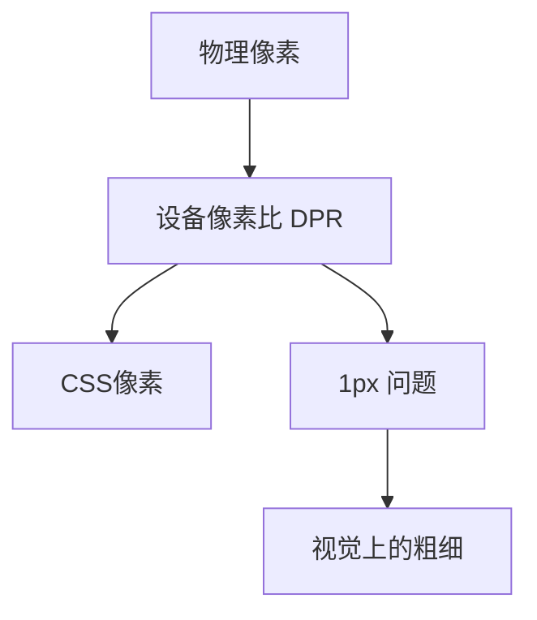

# 移动端 1px 问题的深度解析与最佳实践

> 移动端1px问题是前端开发中的一个经典难题。本文将深入分析其产生原因，并提供多种解决方案的详细对比，帮助你在实际项目中选择最适合的解决方案。

## 问题分析

### 为什么会出现 1px 问题？

在移动端开发中，1px 问题的产生与设备像素比（Device Pixel Ratio，简称 DPR）直接相关。



1. **设备像素比(DPR)**
   - DPR = 物理像素 / CSS像素
   - iPhone 6/7/8: DPR = 2
   - iPhone 6/7/8 Plus: DPR = 3

2. **问题表现**
   - CSS中的1px在高清屏上会显示为多个物理像素
   - 导致边框看起来比设计稿粗

## 解决方案对比

### 方案一：使用 viewport 的 scale 属性

这是一种通过调整视口缩放来实现的解决方案。

#### 实现原理
通过设置 viewport 的 initial-scale 属性，配合 CSS transform 实现精确的 1px 效果。

```html
<meta name="viewport" content="width=device-width, initial-scale=1, maximum-scale=1, minimum-scale=1, user-scalable=no">
```

```css
.element {
  width: 100px;
  height: 1px;
  background-color: #ccc;
  transform: scaleY(0.5);
  transform-origin: 0 0;
}

/* 处理 DPR = 3 的情况 */
@media screen and (min-device-pixel-ratio: 3),
  (-webkit-min-device-pixel-ratio: 3) {
  .element {
    width: 300%;
    height: 300%;
    transform: scale(0.33);
  }
}
```

#### 优点
- 兼容性好
- 可以精确控制线条粗细
- 适用于不同 DPR 的设备

#### 缺点
- 整体页面缩放可能影响其他元素
- 部分浏览器可能存在兼容性问题

### 方案二：使用 rem 单位

通过动态设置根元素的 font-size 来实现精确控制。

#### 实现原理
```javascript
// 动态设置 rem
(function() {
    function setRem() {
        const docEl = document.documentElement;
        const width = docEl.clientWidth;
        const rem = width / 10;
        docEl.style.fontSize = rem + 'px';
    }
    
    window.addEventListener('resize', setRem);
    window.addEventListener('pageshow', function(e) {
        if (e.persisted) {
            setRem();
        }
    });
    
    setRem();
})();
```

```css
html {
  font-size: 100px;
}

.element {
  width: 1rem;
  height: 1px;
  background-color: #ccc;
}
```

#### 优点
- 灵活性高
- 可以配合响应式设计
- 便于维护

#### 缺点
- 需要 JavaScript 支持
- 可能存在小数点精度问题
- 老旧浏览器兼容性问题

### 方案三：使用 border-image 属性

通过图片资源实现精确的 1px 线条。

#### 实现原理
```css
.element {
  width: 100px;
  height: 1px;
  border-width: 0 0 1px 0;
  border-style: solid;
  border-image: url(line.png) 0 0 100% 0 stretch;
}
```

#### 优点
- 可以实现复杂的边框样式
- 精确控制显示效果

#### 缺点
- 需要额外的图片资源
- 修改颜色不便
- 某些场景下可能有性能影响

### 方案四：box-shadow 方案

使用阴影模拟边框，这是一种新的解决思路。

```css
.element {
  box-shadow: 0 0.5px 0 #ccc;
}
```

#### 优点
- 实现简单
- 可以通过调整阴影参数控制效果
- 不需要额外资源

#### 缺点
- 模拟效果可能不够精确
- 部分浏览器支持有限

## 最佳实践建议

1. **场景选择**
   - 简单边框：使用 transform scale 方案
   - 复杂边框：考虑 border-image
   - 响应式设计：结合 rem 方案
   - 高性能要求：优先使用 transform

2. **兼容性处理**
   ```css
   /* 多方案兼容处理 */
   .border-1px {
     position: relative;
   }
   
   .border-1px::after {
     content: '';
     position: absolute;
     left: 0;
     bottom: 0;
     width: 100%;
     height: 1px;
     background-color: #ccc;
     transform: scaleY(0.5);
     transform-origin: 0 0;
   }
   
   @media (-webkit-min-device-pixel-ratio: 3) {
     .border-1px::after {
       transform: scaleY(0.33);
     }
   }
   ```

3. **性能优化**
   - 使用 will-change 提示浏览器优化
   - 避免频繁改变边框样式
   - 合理使用硬件加速

## 调试技巧

1. **设备调试**
   - 使用 Chrome DevTools 的设备模拟
   - 真机测试不同 DPR 设备
   - 检查渲染性能

2. **像素检查**
   ```javascript
   // 检查设备 DPR
   const dpr = window.devicePixelRatio;
   console.log('当前设备 DPR:', dpr);
   ```

## 参考资源

- [MDN - Device Pixel Ratio](https://developer.mozilla.org/en-US/docs/Web/API/Window/devicePixelRatio)
- [Can I Use - transform](https://caniuse.com/?search=transform)
- [CSS Tricks - A Complete Guide to CSS Media Queries](https://css-tricks.com/a-complete-guide-to-css-media-queries/)
- [W3C - Media Queries](https://www.w3.org/TR/css3-mediaqueries/)