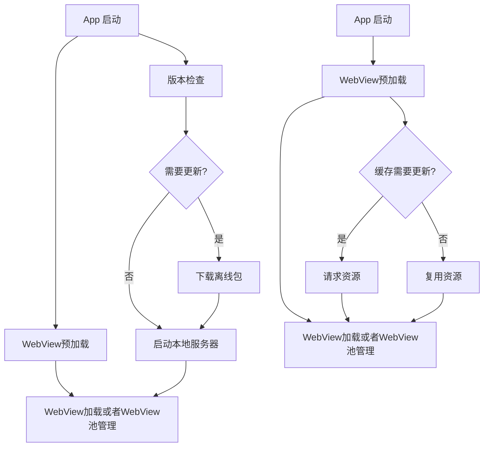
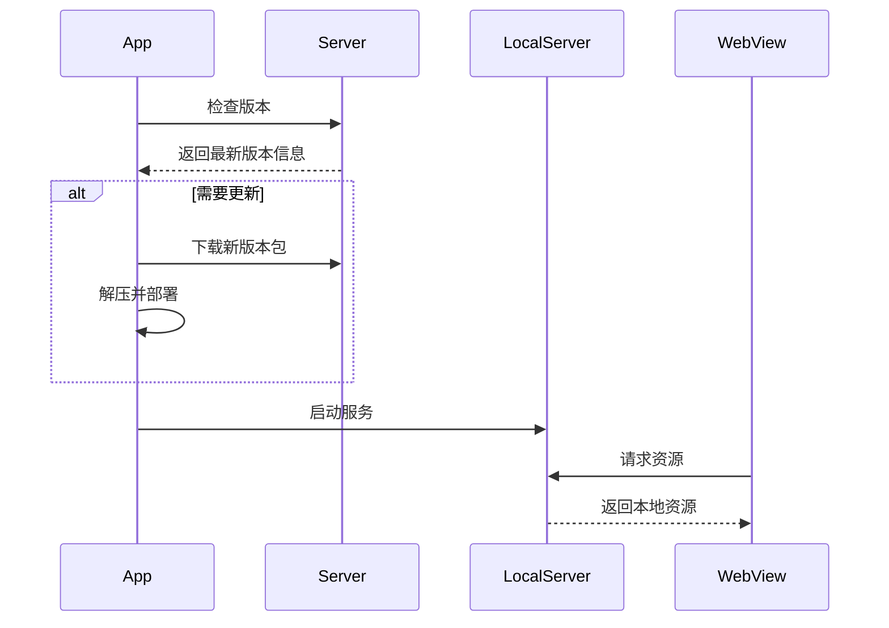
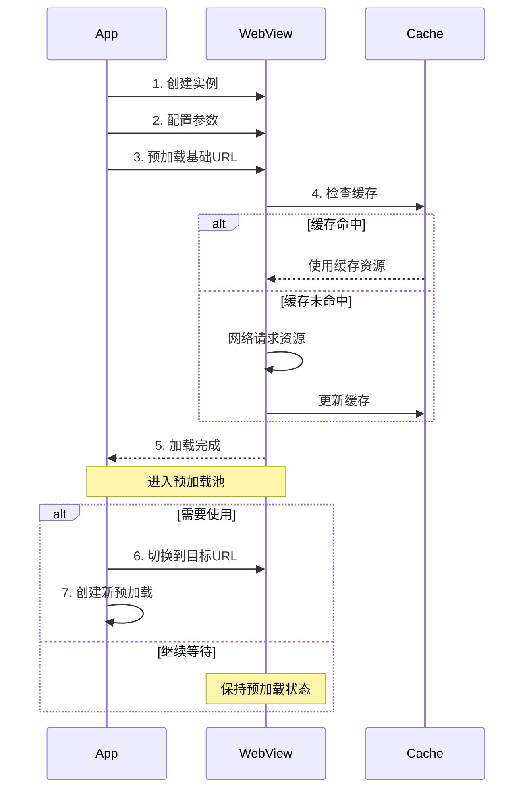
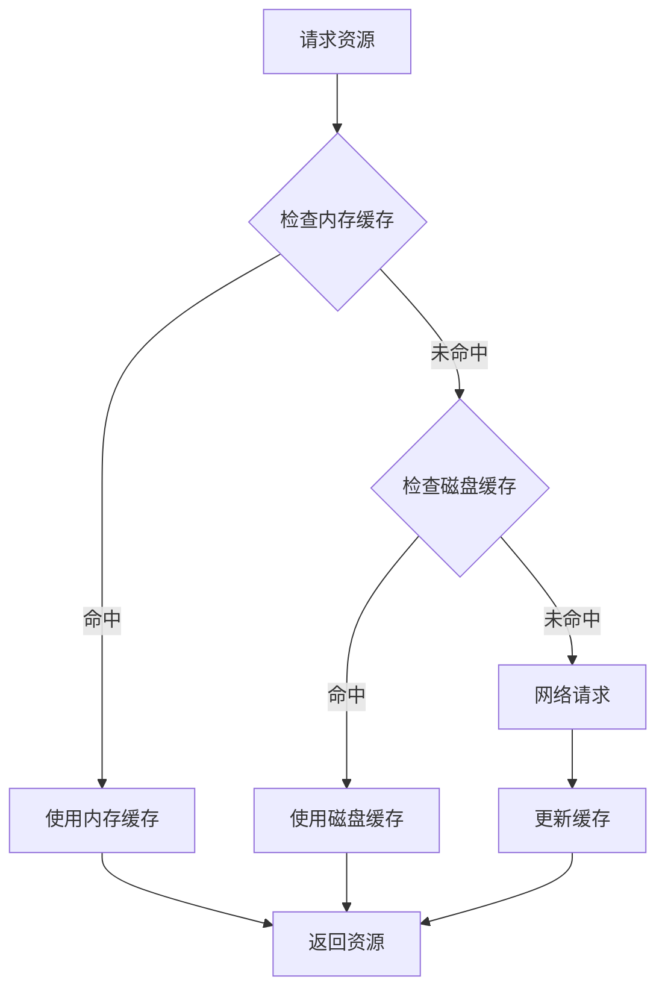
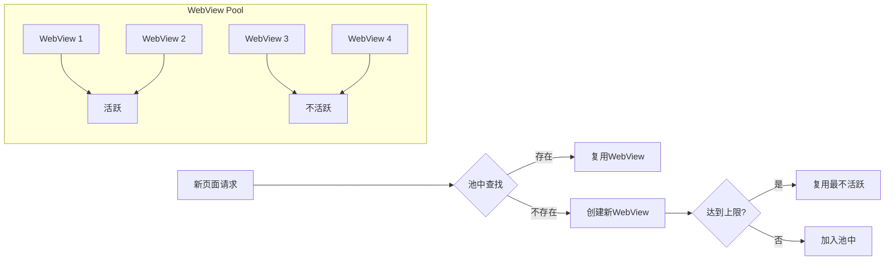

## 背景

在 Hybrid App 开发中，H5 页面的加载性能一直是一个重要的技术挑战。为了提升用户体验，我们需要探索有效的离线化方案。本文将详细介绍两种主流的实现方案，并分享实践过程中的经验与思考。

## 整体方案对比

下面分别展示两种方案的核心流程：



## 方案一：离线包 + LocalServer

### 1. 方案概述

这是一个基于 Android WebView 的离线 Web 应用加载方案，主要包含以下核心功能：

- 离线资源包的下载与版本管理
- 基于 NanoHTTPD 的本地 HTTP 服务器
- WebView 页面加载与缓存策略
- 增量更新机制

### 2. 技术架构

#### 2.1 离线包管理流程

下图展示了离线包的版本管理和资源加载流程：



### 2.1 核心组件

1. **MainActivity**
   - WebView 初始化与配置
   - 离线资源版本检查
   - UI 交互管理

2. **LocalWebServer**
   - 基于 NanoHTTPD 实现
   - 静态资源服务
   - 多种 MIME 类型支持

#### 2.2 工作流程

1. 应用启动检查版本
2. 增量下载资源包
3. 解压并部署资源
4. 启动本地服务器
5. WebView 加载页面

### 关键实现

#### 客户端

##### 版本管理

###### 版本比较

```kotlin
data class VersionInfo(val version: String, val pkgZipUrl: String)
// 检查新版本
private fun isNewerVersion(latest: String, current: String): Boolean {
    val latestParts = latest.split(".").map { it.toInt() }
    val currentParts = current.split(".").map { it.toInt() }

    for (i in 0 until maxOf(latestParts.size, currentParts.size)) {
        val latestPart = latestParts.getOrElse(i) { 0 }
        val currentPart = currentParts.getOrElse(i) { 0 }
        if (latestPart > currentPart) {
            return true
        } else if (latestPart < currentPart) {
            return false
        }
    }
    return false
}
```

###### 检查并下载最新版本

```kotlin
// 从离线目录获取当前版本号
private fun getCurrentVersion(offlineDir: File): String {
    // 从离线目录获取当前版本号
    val versionFile = File(offlineDir, "version.txt")
    return if (versionFile.exists()) {
        println(versionFile.readText().trim())
        versionFile.readText().trim()
    } else {
        "0.0.0"
    }
}
// 检查并下载最新版本
GlobalScope.launch(Dispatchers.IO) {
    val currentVersion = getCurrentVersion(offlineDir)
    if (isNewerVersion(latestVersionInfo.version, currentVersion)) {
        try {
            // 清理旧版本
            cleanOldVersions(offlineDir, latestVersionInfo.version)
            
            // 下载新版本
            val versionDir = File(offlineDir, latestVersionInfo.version)
            if (!versionDir.exists()) {
                versionDir.mkdirs()
            }
            downloadFile(latestVersionInfo.pkgZipUrl, File(versionDir, "package.zip"))
            unzipFile(File(versionDir, "package.zip"), versionDir)
            // 删除zip包
            File(versionDir, "package.zip").delete()
            // 更新版本号
            File(offlineDir, "version.txt").writeText(latestVersionInfo.version)
            
            withContext(Dispatchers.Main) {
                Toast.makeText(this@MainActivity, "新版本下载完成", Toast.LENGTH_SHORT).show()
            }
        } catch (e: Exception) {
            Log.e("MainActivity", "Error updating version", e)
            withContext(Dispatchers.Main) {
                Toast.makeText(this@MainActivity, "更新失败: ${e.message}", Toast.LENGTH_SHORT).show()
            }
        }
    }
}
```

###### 下载并解压压缩包

```kotlin
private suspend fun downloadFile(url: String, outputFile: File) {
    withContext(Dispatchers.IO) {
        val connection = URL(url).openConnection() as HttpURLConnection
        try {
            connection.requestMethod = "GET"
            connection.connect()

            val responseCode = connection.responseCode
            if (responseCode == HttpURLConnection.HTTP_OK) {
                connection.inputStream.use { input ->
                    FileOutputStream(outputFile).use { output ->
                        input.copyTo(output)
                    }
                }
            } else {
                // 处理错误情况
                throw Exception("Failed to download file: ${connection.responseMessage}")
            }
        } catch (e: Exception) {
            e.printStackTrace()
            throw Exception("Error during HTTP request: ${e.message}")
        } finally {
            connection.disconnect()
        }
    }
}

private fun unzipFile(zipFile: File, targetDir: File) {
    println("解压文件: $zipFile 到目录: $targetDir")
    ZipInputStream(zipFile.inputStream()).use { zip ->
        var entry = zip.nextEntry
        while (entry != null) {
            val file = File(targetDir, entry.name)
            println("正在解压: ${entry.name} 到 ${file.absolutePath}")
            if (entry.isDirectory) {
                file.mkdirs()
            } else {
                file.outputStream().use { output ->
                    zip.copyTo(output)
                }
            }
            entry = zip.nextEntry
        }
    }
}
```

###### 删除旧版本

```kotlin
private fun cleanOldVersions(offlineDir: File, newVersion: String) {
    offlineDir.listFiles()?.forEach { file ->
        if (file.isDirectory && file.name != newVersion) {
            file.deleteRecursively()
            Log.d("MainActivity", "Deleted old version: ${file.name}")
        }
    }
}
```

###### 销毁

```kotlin
override fun onDestroy() {
    // 停止本地服务器
    stopService(Intent(this, LocalWebServer::class.java))
    super.onDestroy()
}
```

##### 本地服务器

```kotlin
package com.example.myapplication

import android.app.Service
import android.content.Intent
import android.os.IBinder
import android.util.Log
import fi.iki.elonen.NanoHTTPD
import java.io.File
import java.io.FileInputStream
import java.io.IOException

class LocalWebServer : Service() {
    private var server: WebServer? = null
    
    companion object {
        const val PORT = 8888
        const val EXTRA_ROOT_PATH = "root_path"
        private const val TAG = "LocalWebServer"
    }

    private inner class WebServer(private val rootPath: String) : NanoHTTPD("localhost", PORT) {
        override fun serve(session: IHTTPSession): Response {
            var uri = session.uri
            Log.d(TAG, "Received request for URI: $uri")
            
            // 提取不带参数的路径
            uri = uri.split("?")[0]
            
            // 对于所有HTML请求都返回index.html，让前端路由处理
            if (!uri.contains(".")) {
                uri = "/index.html"
            }

            val file = File(rootPath, uri)
            Log.d(TAG, "Looking for file: ${file.absolutePath}")
            
            return try {
                if (file.exists() && file.isFile) {
                    val mimeType = getMimeType(file.name)
                    Log.d(TAG, "Serving file: ${file.absolutePath} with mime type: $mimeType")
                    newChunkedResponse(
                        Response.Status.OK,
                        mimeType,
                        FileInputStream(file)
                    )
                } else {
                    // 如果文件不存在且存在HTML请求，返回index.html
                    if (!uri.contains(".")) {
                        val indexFile = File(rootPath, "index.html")
                        if (indexFile.exists()) {
                            Log.d(TAG, "Serving index.html for route: $uri")
                            newChunkedResponse(
                                Response.Status.OK,
                                "text/html",
                                FileInputStream(indexFile)
                            )
                        } else {
                            Log.e(TAG, "Index file not found")
                            newFixedLengthResponse(Response.Status.NOT_FOUND, MIME_PLAINTEXT, "404 Not Found")
                        }
                    } else {
                        Log.e(TAG, "File not found: ${file.absolutePath}")
                        newFixedLengthResponse(Response.Status.NOT_FOUND, MIME_PLAINTEXT, "404 Not Found")
                    }
                }
            } catch (e: IOException) {
                Log.e(TAG, "Error serving file: ${file.absolutePath}", e)
                newFixedLengthResponse(Response.Status.INTERNAL_ERROR, MIME_PLAINTEXT, "Error: ${e.message}")
            }
        }
    }

    override fun onCreate() {
        super.onCreate()
        Log.d(TAG, "Service onCreate")
    }

    override fun onStartCommand(intent: Intent?, flags: Int, startId: Int): Int {
        Log.d(TAG, "Service onStartCommand")
        intent?.getStringExtra(EXTRA_ROOT_PATH)?.let { rootPath ->
            Log.d(TAG, "Starting server with root path: $rootPath")
            server = WebServer(rootPath)
            try {
                server?.start()
                Log.d(TAG, "Server started successfully on port $PORT")
            } catch (e: IOException) {
                Log.e(TAG, "Failed to start server", e)
            }
        }
        return START_STICKY
    }

    override fun onBind(intent: Intent?): IBinder? = null

    override fun onDestroy() {
        Log.d(TAG, "Service onDestroy")
        server?.stop()
        super.onDestroy()
    }

    private fun getMimeType(fileName: String): String {
        return when {
            fileName.endsWith(".html", true) -> "text/html"
            fileName.endsWith(".js", true) -> "application/javascript"
            fileName.endsWith(".css", true) -> "text/css"
            fileName.endsWith(".json", true) -> "application/json"
            fileName.endsWith(".png", true) -> "image/png"
            fileName.endsWith(".jpg", true) || fileName.endsWith(".jpeg", true) -> "image/jpeg"
            fileName.endsWith(".gif", true) -> "image/gif"
            fileName.endsWith(".svg", true) -> "image/svg+xml"
            fileName.endsWith(".woff", true) -> "font/woff"
            fileName.endsWith(".woff2", true) -> "font/woff2"
            fileName.endsWith(".ttf", true) -> "font/ttf"
            fileName.endsWith(".eot", true) -> "application/vnd.ms-fontobject"
            else -> "application/octet-stream"
        }
    }
}
```

WebView配置

```kotlin
webView.settings.apply {
    javaScriptEnabled = true
    domStorageEnabled = true
    allowFileAccess = true
    allowContentAccess = true
    mixedContentMode = android.webkit.WebSettings.MIXED_CONTENT_ALWAYS_ALLOW
    cacheMode = android.webkit.WebSettings.LOAD_NO_CACHE
    allowUniversalAccessFromFileURLs = true
    allowFileAccessFromFileURLs = true
}
```

#### 前端

##### 版本发布后台

用来管理H5版本，代码包

### 注意事项

- 确保网络权限配置正确
- 资源包的下载和解压需要在后台线程进行
- WebView的安全配置要根据实际需求调整
- 本地服务器的端口号要避免冲突

### 优化建议

1. 添加资源包完整性校验
2. 实现增量更新机制
3. 添加离线资源预加载
4. 优化版本检查策略
5. 添加错误重试机制

## 方案二：WebView 预加载 + 缓存资源

### 1. 方案概述

该方案采用 WebView 预加载和资源缓存策略，主要特点：

- 单例模式管理 WebView 实例
- 智能预加载机制
- 高效的缓存策略
- 优化的页面切换体验

### 2. 技术实现

#### 客户端

##### WebView 预加载

WebView 预加载是一种优化技术，通过提前初始化和加载 WebView 来减少用户等待时间。下面详细说明其工作流程：



#### 缓存机制



#### 关键代码实现

```kotlin
  // 预加载基础URL
  WebViewManager.preloadUrl(context, baseUrl) {
      Log.d(TAG, "WebView预加载完成")
  }  
```

1. **预加载配置**
```kotlin
    fun preloadUrl(context: Context, url: String, onLoadComplete: () -> Unit) {
        // 如果已经有预加载的 WebView，直接使用
        if (preloadedWebView != null) {
            Log.d(TAG, "使用已存在的 WebView 加载新URL")
            preloadedWebView?.loadUrl(url)
            return
        }

        Log.d(TAG, "创建新的 WebView 并预加载")
        preloadedWebView = WebView(context.applicationContext)

        preloadedWebView?.apply {
            settings.apply {
                javaScriptEnabled = true
                domStorageEnabled = true
                
                // 启用缓存
                cacheMode = WebSettings.LOAD_DEFAULT
                // 设置数据库缓存
                databaseEnabled = true
                // 允许文件访问
                allowFileAccess = true
                
                // 启用 DOM storage API
                domStorageEnabled = true
                
                // 设置缓存模式，优先使用缓存
                cacheMode = WebSettings.LOAD_CACHE_ELSE_NETWORK
                
                // 允许混合内容
                mixedContentMode = WebSettings.MIXED_CONTENT_ALWAYS_ALLOW
                
                // 设置默认编码
                defaultTextEncodingName = "utf-8"

                // 允许 JavaScript 接口调用
                javaScriptCanOpenWindowsAutomatically = true
                // 允许跨域请求
                allowUniversalAccessFromFileURLs = true
                allowFileAccessFromFileURLs = true
            }

            // 添加 WebView 调试支持
            WebView.setWebContentsDebuggingEnabled(true)

            // 创建并设置 JSBridge
            val bridge = JSBridge(this)
            jsBridge = bridge
            addJavascriptInterface(bridge, "JSBridge")

            webViewClient = object : WebViewClient() {
                override fun shouldInterceptRequest(
                    view: WebView?,
                    request: WebResourceRequest?
                ): WebResourceResponse? {
                    request?.url?.toString()?.let { resourceUrl ->
                        // 打印请求信息
                        Log.d(TAG, "请求URL: $resourceUrl")
                        
                        // 检查是否是需要拦截的接口
                        if (shouldInterceptApi(resourceUrl)) {
                            Log.d(TAG, "拦截到接口调用: $resourceUrl")
                            // 返回空响应，强制重新请求
                            return WebResourceResponse(null, null, null)
                        }

                        // 记录缓存信息
                        logCacheInfo(context.cacheDir, resourceUrl)
                    }
                    return super.shouldInterceptRequest(view, request)
                }

                override fun shouldOverrideUrlLoading(
                    view: WebView?,
                    request: WebResourceRequest?
                ): Boolean {
                    request?.url?.toString()?.let { url ->
                        Log.d(TAG, "页面跳转: $url")
                    }
                    return super.shouldOverrideUrlLoading(view, request)
                }

                // 处理 SSL 错误
                override fun onReceivedSslError(
                    view: WebView?,
                    handler: SslErrorHandler?,
                    error: SslError?
                ) {
                    handler?.proceed() // 允许证书错误
                }

                // 监控页面加载错误
                override fun onReceivedError(
                    view: WebView?,
                    request: WebResourceRequest?,
                    error: WebResourceError?
                ) {
                    Log.e(TAG, "加载错误: ${error?.description}, URL: ${request?.url}")
                    super.onReceivedError(view, request, error)
                }

                override fun onPageFinished(view: WebView?, loadedUrl: String?) {
                    super.onPageFinished(view, loadedUrl)
                    Log.d(TAG, "预加载完成: $loadedUrl")
                    // 注入 JavaScript 代码
                    bridge.inject()
                    // 预加载完成后清除历史记录
                    view?.clearHistory()
                    isLoaded = true
                    onLoadComplete()
                    
                    // 打印 WebView 缓存统计信息
                    printWebViewCacheStats(context)
                }
            }

            // 添加 WebChromeClient 处理 JS 对话框等
            webChromeClient = object : WebChromeClient() {
                override fun onJsAlert(
                    view: WebView?,
                    url: String?,
                    message: String?,
                    result: JsResult?
                ): Boolean {
                    Log.d(TAG, "JS Alert: $message")
                    result?.confirm()
                    return true
                }

                override fun onConsoleMessage(consoleMessage: ConsoleMessage?): Boolean {
                    Log.d(TAG, "Console: ${consoleMessage?.message()}")
                    return true
                }
            }

            loadUrl(url)
        }
    }
```

#### 性能优化建议

1. **内存管理**
   - 控制预加载实例数量
   - 及时释放不需要的资源
   - 监控内存使用情况

2. **加载优化**
   - 选择合适的预加载时机
   - 优化基础 URL 的资源大小
   - 实现智能预加载策略

3. **缓存优化**
   - 合理设置缓存策略
   - 定期清理过期缓存
   - 优先使用本地缓存

##### 设置缓存

```kotlin
  webView.settings.apply {
      // 启用缓存
      cacheMode = WebSettings.LOAD_DEFAULT
      // 启用 DOM storage API 
      domStorageEnabled = true
      // 启用数据库缓存
      databaseEnabled = true
  }  
```

##### 页面切换

- URL 替换而非重新加载webview

```kotlin
  fun replaceUrl(webView: WebView, newUrl: String) {
      // 停止当前加载
      webView.stopLoading()
      // 清除历史记录
      webView.clearHistory()
      
      // 保存原有的 WebViewClient
      val originalWebViewClient = webView.webViewClient
      
      // 设置临时的 WebViewClient 来监听空白页面加载完成
      webView.webViewClient = object : WebViewClient() {
          override fun onPageFinished(view: WebView?, url: String?) {
              super.onPageFinished(view, url)
              if (url == "about:blank") {
                  // 恢复原有的 WebViewClient
                  webView.webViewClient = originalWebViewClient
                  // 延迟 500ms 后加载新 URL
                  webView.postDelayed({
                      webView.loadUrl(newUrl)
                      Log.d(TAG, "已清除历史记录并加载新URL: $newUrl")
                  }, 500) // 500ms 延迟
              }
          }
      }
      
      // 加载空白页面
      webView.loadUrl("about:blank")
  }  
```

##### 接口请求（可做可不做）

- JSBridge 实现双向通信

```kotlin
  // Web 端注册
  window.AndroidBridge = {
      registerRefreshMethod: function(methodName) {
          window.JSBridge.registerRefreshMethod(methodName);
      },
      log: function(message) {
          window.JSBridge.log(JSON.stringify(message));
      }
  }; 
```

- 原生端实现

```kotlin
class JSBridge(private val webView: WebView) {
  @JavascriptInterface
  fun registerRefreshMethod(methodName: String) {
      refreshCallback = {
          webView.post {
              webView.evaluateJavascript("$methodName();") { result ->
                  Log.d(TAG, "刷新方法执行结果: $result")
              }
          }
      }
  }
}
```

#### 错误处理

- 完整的错误监控
- SSL 错误处理
- 资源加载监控
- 控制台日志捕获

### 注意事项

1. WebView 实例复用需要注意内存管理
2. 预加载需要合理选择基础URL
3. 页面切换时要清理历史记录
4. SSL 证书问题需要合理处理
5. 缓存策略需要根据业务需求调整

### 优化建议

1. 合理使用预加载机制
2. 优化缓存策略
3. 控制 WebView 内存使用
4. 监控页面加载性能
5. 优化通信机制

### 2. WebView 池化管理

下图展示了 WebView 池化管理的工作机制：



## 方案对比

| 维度 | 离线包 + LocalServer | WebView 预加载 + 缓存资源 |
|------|---------------------|------------------------|
| 技术复杂度 | 较高，需要实现本地服务器和版本管理 | 中等，主要是 WebView 管理和缓存优化 |
| 维护成本 | 需要维护版本发布系统 | 较低，随前端发版更新 |
| 首屏加载 | 极快，直接加载本地资源 | 较快，依赖缓存策略 |
| 资源更新 | 精确控制，支持增量更新 | 依赖 WebView 缓存机制 |
| 内存占用 | 较低，仅本地服务器开销 | 较高，需要维持 WebView 实例 |
| 适用场景 | 大型应用，对加载性能要求高 | 中小型应用，需要灵活更新 |

## 优化思路

### 1. WebView 复用优化

基于实践经验，我们提出以下优化方案：

#### 方案 A：共享 WebView + 历史记录管理
- 优点：资源占用少
- 缺点：
  - 页面切换可能闪烁
  - 路由栈管理复杂

#### 方案 B：多 WebView 池化管理（推荐）
- 核心思路：
  - 预加载初始 WebView
  - 动态创建新实例（上限 4 个）
  - LRU 策略复用不活跃实例
- 优势：
  - 消除页面切换闪烁
  - 独立路由栈管理
  - 支持页面状态保持
- 注意事项：
  - 需要设计刷新机制
  - 内存使用需要监控

## 总结与建议

1. **方案选择**
   - 大型应用推荐离线包方案
   - 中小型应用可选 WebView 预加载方案

2. **实施建议**
   - 合理设计缓存策略
   - 做好性能监控
   - 优化内存管理
   - 完善错误处理

3. **未来展望**
   - 探索 ServiceWorker 方案
   - 研究 PWA 技术应用
   - 优化增量更新机制
