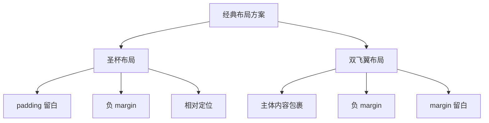

圣杯布局和双飞翼布局是前端开发中的经典布局方案，本文将深入分析它们的实现原理、异同点和最佳实践。

## 布局概述



### 布局特点
- 三栏布局
- 中间内容区域优先渲染
- 两侧栏宽度固定
- 中间区域宽度自适应
- 支持内容区域最小宽度设置

## 圣杯布局实现

### 1. HTML 结构

```html
<div class="container">
  <div class="center">中间内容</div>
  <div class="left">左侧栏</div>
  <div class="right">右侧栏</div>
</div>
```

### 2. CSS 实现

```css
.container {
  padding: 0 220px 0 200px; /* 为左右两栏预留空间 */
  min-width: 400px; /* 确保最小宽度 */
}

.center, .left, .right {
  float: left;
  min-height: 400px;
  position: relative;
}

.center {
  width: 100%;
  background: #f0f0f0;
}

.left {
  width: 200px;
  margin-left: -100%; /* 移动到 center 的左边 */
  left: -200px; /* 相对定位移动到预留空间 */
  background: #e0e0e0;
}

.right {
  width: 220px;
  margin-right: -220px; /* 移动到最右侧 */
  background: #d0d0d0;
}
```

### 3. 实现原理解析

1. **容器设置 padding**
   - 左右 padding 为两侧栏预留空间
   - 确保内容不会被遮挡

2. **使用浮动**
   - 三栏均设置 `float: left`
   - 使其脱离文档流水平排列

3. **负 margin 定位**
   - 左栏：`margin-left: -100%` 回到上一行最左侧
   - 右栏：`margin-right: -220px` 确保不会换行

4. **相对定位微调**
   - 左栏：`left: -200px` 移动到预留空间
   - 右栏自动占据右侧预留空间

### 4. 效果展示


## 双飞翼布局实现

### 1. HTML 结构

```html
<div class="main">
  <div class="main-content">中间内容</div>
</div>
<div class="left">左侧栏</div>
<div class="right">右侧栏</div>
```

### 2. CSS 实现

```css
.main, .left, .right {
  float: left;
  min-height: 400px;
}

.main {
  width: 100%;
}

.main-content {
  margin: 0 220px 0 200px; /* 为两侧栏让出空间 */
  background: #f0f0f0;
  min-height: 400px;
}

.left {
  width: 200px;
  margin-left: -100%; /* 移动到 main 的左边 */
  background: #e0e0e0;
}

.right {
  width: 220px;
  margin-left: -220px; /* 移动到 main 的右边 */
  background: #d0d0d0;
}
```

### 3. 实现原理解析

1. **主体区域包裹**
   - 外层 main 容器宽度 100%
   - 内层 main-content 通过 margin 留白

2. **使用浮动**
   - 三个主要区块均设置 `float: left`
   - 形成水平排列

3. **负 margin 定位**
   - 左栏：`margin-left: -100%` 上移一行
   - 右栏：`margin-left: -220px` 紧贴主体右侧

### 4. 效果展示


## 两种布局方案对比

### 共同点

1. **布局效果相同**
   - 三栏式布局
   - 中间自适应
   - 两侧固定宽度

2. **技术特点**
   - 使用 float 布局
   - 使用负 margin 定位
   - 中间栏优先渲染

### 主要区别

1. **DOM 结构**
   - 圣杯：三栏统一父容器
   - 双飞翼：主体内容独立包裹

2. **实现方式**
   - 圣杯：使用 padding + 相对定位
   - 双飞翼：使用 margin + 嵌套结构

3. **兼容性**
   - 圣杯：需要设置最小宽度
   - 双飞翼：结构更加稳定

## 最佳实践

### 1. 圣杯布局适用场景
- 三栏宽度固定
- 对 DOM 结构要求严格
- 需要考虑最小宽度

```css
/* 圣杯布局最佳实践 */
.container {
  padding: 0 220px 0 200px;
  min-width: calc(200px + 220px + 400px); /* 左右栏宽度加上最小内容宽度 */
}
```

### 2. 双飞翼布局适用场景
- 需要更灵活的内容区域
- 对布局稳定性要求高
- 不需要设置最小宽度

```css
/* 双飞翼布局最佳实践 */
.main-content {
  margin: 0 220px 0 200px;
  min-height: 400px;
  box-sizing: border-box;
  padding: 20px;
}
```

### 3. 响应式适配

```css
@media screen and (max-width: 768px) {
  /* 在小屏幕上转为单列布局 */
  .container {
    padding: 0;
  }
  
  .center, .left, .right {
    float: none;
    width: 100%;
    margin: 0;
    position: static;
  }
  
  .main-content {
    margin: 0;
  }
}
```

## 现代布局方案

虽然圣杯布局和双飞翼布局是经典的解决方案，但在现代前端开发中，我们还有更多选择：

### 1. Flexbox 实现

```css
.container {
  display: flex;
}

.center {
  flex: 1;
  order: 2;
}

.left {
  width: 200px;
  order: 1;
}

.right {
  width: 220px;
  order: 3;
}
```

### 2. Grid 实现

```css
.container {
  display: grid;
  grid-template-columns: 200px 1fr 220px;
  gap: 20px;
}
```

## 调试技巧

1. **使用背景色区分**
   ```css
   .center { background: #f0f0f0; }
   .left { background: #e0e0e0; }
   .right { background: #d0d0d0; }
   ```

2. **添加边框辅助调试**
   ```css
   .container * {
     border: 1px solid #ccc;
     box-sizing: border-box;
   }
   ```

## 参考资源

- [MDN - CSS Float](https://developer.mozilla.org/zh-CN/docs/Web/CSS/float)
- [MDN - CSS Position](https://developer.mozilla.org/zh-CN/docs/Web/CSS/position)
- [CSS Grid 完全指南](https://css-tricks.com/snippets/css/complete-guide-grid/)
- [Flexbox 完全指南](https://css-tricks.com/snippets/css/a-guide-to-flexbox/)

<ArticleFooter />