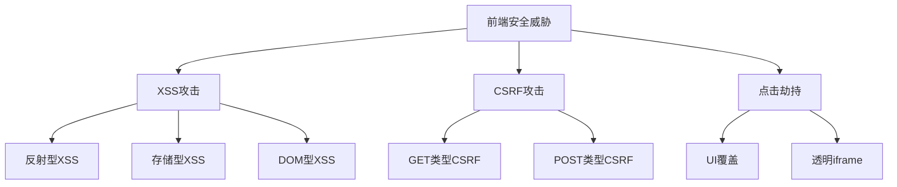
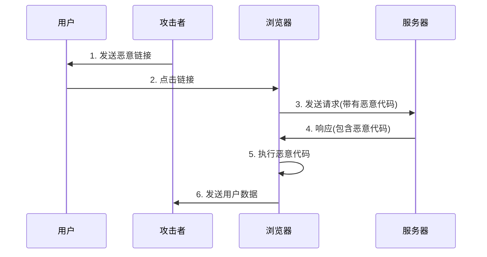
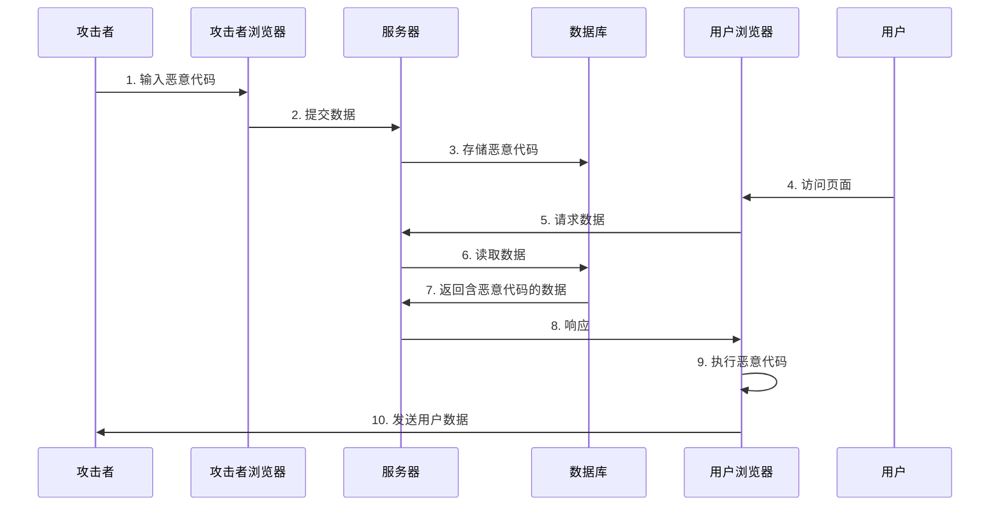
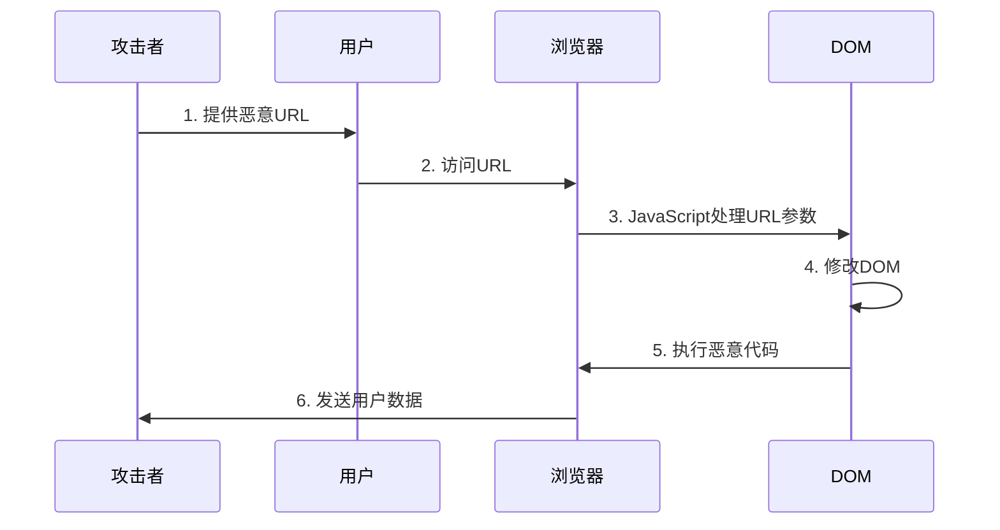
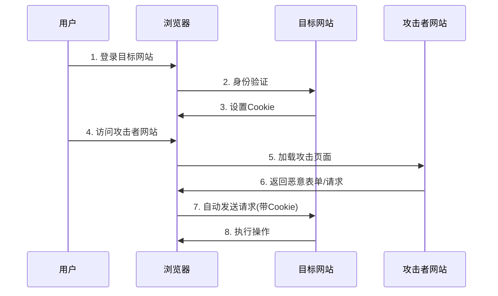
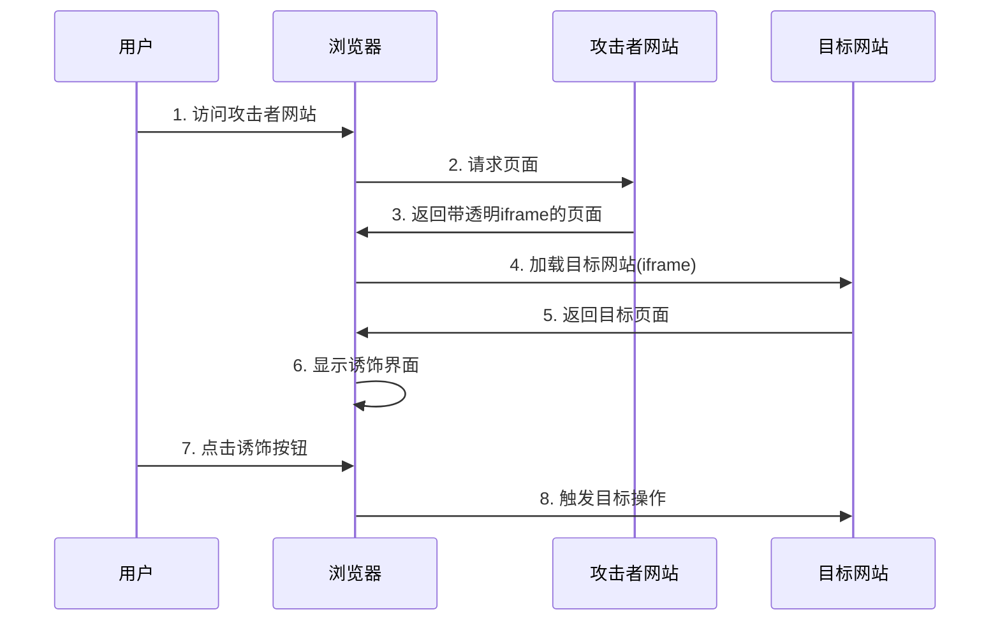
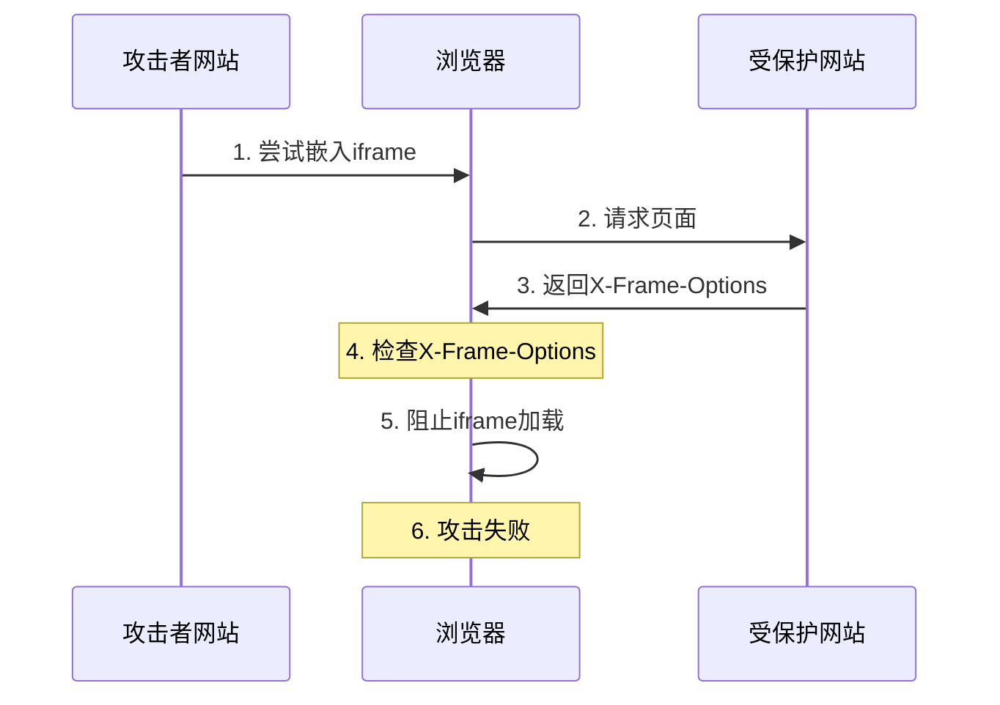

# 前端安全防护完全指南

> 本文深入探讨前端开发中的常见安全问题，并提供全面的防护策略和最佳实践，帮助开发者构建更安全的 Web 应用。

## 安全威胁概述



## 1. 跨站脚本攻击（XSS）

### 1.1 XSS 类型及原理

#### 反射型 XSS
- 非持久性攻击
- 通过 URL 参数注入恶意代码
- 服务端未经处理直接返回用户输入



```javascript
// 危险的URL示例
https://example.com/search?q=<script>alert('XSS')</script>

// 服务端不安全的处理
app.get('/search', (req, res) => {
    res.send(`搜索结果: ${req.query.q}`); // 直接输出用户输入
});
```

#### 存储型 XSS
- 持久性攻击
- 恶意代码存储在数据库中
- 其他用户访问页面时触发攻击



```javascript
// 危险的评论输入
const comment = '<script>steal(document.cookie)</script>';

// 数据库中存储的恶意脚本
{
    "comment": "<script>steal(document.cookie)</script>",
    "user": "attacker"
}
```

#### DOM 型 XSS
- 前端 JavaScript 直接使用不可信数据
- 修改 DOM 结构触发攻击
- 不经过服务端



```javascript
// 危险的 DOM 操作
document.getElementById('content').innerHTML = location.hash.substring(1);
```

### 1.2 XSS 防护措施

#### 输入验证和净化
```javascript
// 使用 DOMPurify 净化用户输入
import DOMPurify from 'dompurify';

const clean = DOMPurify.sanitize(userInput, {
    ALLOWED_TAGS: ['b', 'i', 'em', 'strong'],
    ALLOWED_ATTR: ['title']
});
```

#### 输出编码
```javascript
// HTML 转义函数
function escapeHtml(unsafe) {
    return unsafe
        .replace(/&/g, "&amp;")
        .replace(/</g, "&lt;")
        .replace(/>/g, "&gt;")
        .replace(/"/g, "&quot;")
        .replace(/'/g, "&#039;");
}

// React 自动转义
const UserInput = ({ data }) => <div>{data}</div>;
```

#### CSP 配置
```html
<!-- 内容安全策略配置 -->
<meta http-equiv="Content-Security-Policy" 
    content="default-src 'self'; 
    script-src 'self' 'unsafe-inline' 'unsafe-eval'; 
    style-src 'self' 'unsafe-inline';">
```

## 2. 跨站请求伪造（CSRF）

### 2.1 攻击原理
- 利用用户已登录的身份
- 在第三方网站发起请求
- 自动携带目标站点的 Cookie



```javascript
// 攻击者的恶意网站代码
<form action="https://bank.example.com/transfer" method="POST" id="stealMoney">
    <input type="hidden" name="amount" value="10000">
    <input type="hidden" name="to" value="attacker">
</form>
<script>document.getElementById('stealMoney').submit();</script>
```

### 2.2 防护措施

#### Token 验证
```javascript
// 服务端生成 token
const csrfToken = crypto.randomBytes(16).toString('hex');

// 前端请求携带 token
const headers = {
    'X-CSRF-Token': csrfToken,
    'Content-Type': 'application/json',
};

fetch('/api/data', {
    method: 'POST',
    headers,
    credentials: 'include',
    body: JSON.stringify(data)
});
```

#### SameSite Cookie
```javascript
// 设置 Cookie
Set-Cookie: sessionId=abc123; SameSite=Strict; Secure; HttpOnly
```

## 3. 点击劫持

### 3.1 攻击原理



```html
<!-- 攻击者的页面 -->
<style>
    iframe {
        width: 500px;
        height: 500px;
        position: absolute;
        top: -100px;
        left: -100px;
        opacity: 0.0001;
        z-index: 2;
    }
    .fake-button {
        position: absolute;
        top: 300px;
        left: 300px;
        z-index: 1;
    }
</style>
<iframe src="https://victim-site.com/"></iframe>
<button class="fake-button">点击领取奖励</button>
```

### 3.2 防护措施



#### X-Frame-Options
```javascript
// 服务端设置
response.setHeader('X-Frame-Options', 'SAMEORIGIN');
```

#### CSP frame-ancestors
```javascript
// 服务端设置
response.setHeader(
    'Content-Security-Policy',
    "frame-ancestors 'self' https://trusted-site.com"
);
```

#### JavaScript 防护
```javascript
// 判断当前网页是否被嵌入iframe
if (window.self !== window.top) {
    window.top.location = window.self.location;
}
```

## 4. 其他安全措施

### 4.1 安全的 Cookie 配置
```javascript
// 设置安全的 Cookie
app.use(session({
    cookie: {
        secure: true,         // 仅通过 HTTPS 传输
        httpOnly: true,       // 禁止 JavaScript 访问
        sameSite: 'strict',   // 严格的同源策略
        maxAge: 3600000      // 有效期限
    }
}));
```

### 4.2 HTTPS 配置
```javascript
// Node.js HTTPS 服务器配置
const https = require('https');
const fs = require('fs');

const options = {
    key: fs.readFileSync('private-key.pem'),
    cert: fs.readFileSync('certificate.pem'),
    ciphers: [
        "ECDHE-RSA-AES128-GCM-SHA256",
        "ECDHE-ECDSA-AES128-GCM-SHA256"
    ].join(':')
};

https.createServer(options, app).listen(443);
```

## 安全检查清单

1. **XSS 防护**
   - [ ] 实施内容安全策略 (CSP)
   - [ ] 对用户输入进行验证和净化
   - [ ] 使用安全的模板引擎
   - [ ] 对输出进行适当转义

2. **CSRF 防护**
   - [ ] 实施 CSRF Token
   - [ ] 配置 SameSite Cookie
   - [ ] 验证请求来源
   - [ ] 使用安全的 HTTP 方法

3. **点击劫持防护**
   - [ ] 配置 X-Frame-Options
   - [ ] 实施 frame-ancestors CSP
   - [ ] 添加 JavaScript 防护层

4. **通用安全措施**
   - [ ] 启用 HTTPS
   - [ ] 配置安全的 Cookie
   - [ ] 实施适当的访问控制
   - [ ] 定期进行安全审计

## 参考资源

- [OWASP Top 10](https://owasp.org/www-project-top-ten/)
- [MDN Web 安全](https://developer.mozilla.org/zh-CN/docs/Web/Security)
- [Content Security Policy](https://developer.mozilla.org/zh-CN/docs/Web/HTTP/CSP)
- [DOMPurify 文档](https://github.com/cure53/DOMPurify)

<ArticleFooter />