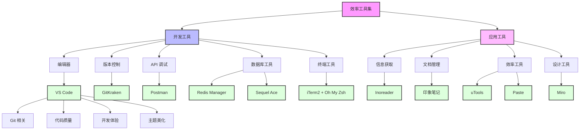

在当今快速发展的技术世界中，掌握合适的工具对于提升工作效率至关重要。本文将分享我在2022年工作中使用的各类效率工具，包括它们的特点、使用场景和配置技巧。

## 工具概览



## 一、开发工具篇

### 1. 代码编辑器 - VS Code

VS Code 是我使用过的最强大的编辑器，下面分享一些必备插件和配置：

#### 1.1 Git 相关
- **GitLens**: 
  - 功能：实时查看代码行的提交信息
  - 使用场景：排查代码历史问题
  - 配置建议：开启 blame 视图

- **Gitlab Workflow**:
  - 功能：快速跳转到 GitLab pipeline
  - 使用技巧：配置快捷键 `cmd+shift+p`

#### 1.2 代码质量
- **Prettier + ESLint**:
  ```json
  // settings.json 推荐配置
  {
    "editor.formatOnSave": true,
    "editor.defaultFormatter": "esbenp.prettier-vscode",
    "editor.codeActionsOnSave": {
      "source.fixAll.eslint": true
    }
  }
  ```

#### 1.3 开发体验
- **Image preview**: 图片预览
- **Auto Close Tag**: 自动闭合标签
- **Auto Import**: 自动导入
- **Auto Rename Tag**: 自动重命名标签对

#### 1.4 主题美化
- **Atom One Dark Theme**: 护眼配色
- **Material Icon Theme**: 清晰的文件图标

### 2. 数据库工具

#### 2.1 Another Redis Desktop Manager
- 特点：界面直观，支持多数据库
- 使用技巧：
  - 支持批量操作
  - 可视化数据结构
  - 支持命令行模式

#### 2.2 Sequel Ace
- 功能：MySQL 客户端
- 优点：
  - 原生 ARM 支持
  - 查询优化建议
  - 表结构可视化

### 3. 终端增强

#### 3.1 iTerm2 + Oh My Zsh
推荐配置：
```bash
# .zshrc 配置
plugins=(
  git
  zsh-autosuggestions
  zsh-syntax-highlighting
)

# 别名配置
alias gs="git status"
alias gp="git pull --rebase"
alias dc="docker-compose"
```

### 4. API 调试 - Postman
使用技巧：
- 环境变量管理
- 测试脚本编写
- 团队协作

## 二、应用工具篇

### 1. 信息获取与管理

#### 1.1 Inoreader
- 功能：RSS 阅读器
- 使用场景：
  - 技术博客订阅
  - 新闻聚合
  - 内容过滤

#### 1.2 印象笔记 + 剪藏
工作流：
1. 使用剪藏保存文章
2. 标注重点内容
3. 定期整理归档
4. 知识复习

### 2. 效率工具

#### 2.1 uTools
常用插件推荐：
- 翻译助手
- 图片压缩
- 正则工具
- 时间戳转换

#### 2.2 Paste
- 功能：剪贴板管理
- 亮点：
  - iCloud 同步
  - 智能分类
  - 快捷搜索

### 3. 设计协作

#### 3.1 Miro
使用场景：
- 架构设计
- 流程图绘制
- 头脑风暴
- 团队协作

## 工具选择建议

1. **考虑因素**
   - 学习成本
   - 稳定性
   - 团队协作
   - 升级维护

2. **最佳实践**
   - 保持工具链简单
   - 重视自动化配置
   - 定期更新维护
   - 建立个人知识库

## 总结

工具的选择和使用是一个持续优化的过程。建议：

1. 从实际需求出发选择工具
2. 投入时间学习工具的高级特性
3. 及时更新工具版本和配置
4. 在团队中分享工具使用经验

## 参考资源

- [VS Code 官方文档](https://code.visualstudio.com/docs)
- [Oh My Zsh 配置指南](https://github.com/ohmyzsh/ohmyzsh)
- [Postman 学习中心](https://learning.postman.com/)
- [uTools 插件市场](https://u.tools/plugins)

<ArticleFooter />