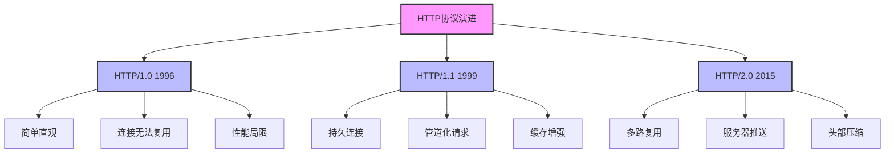
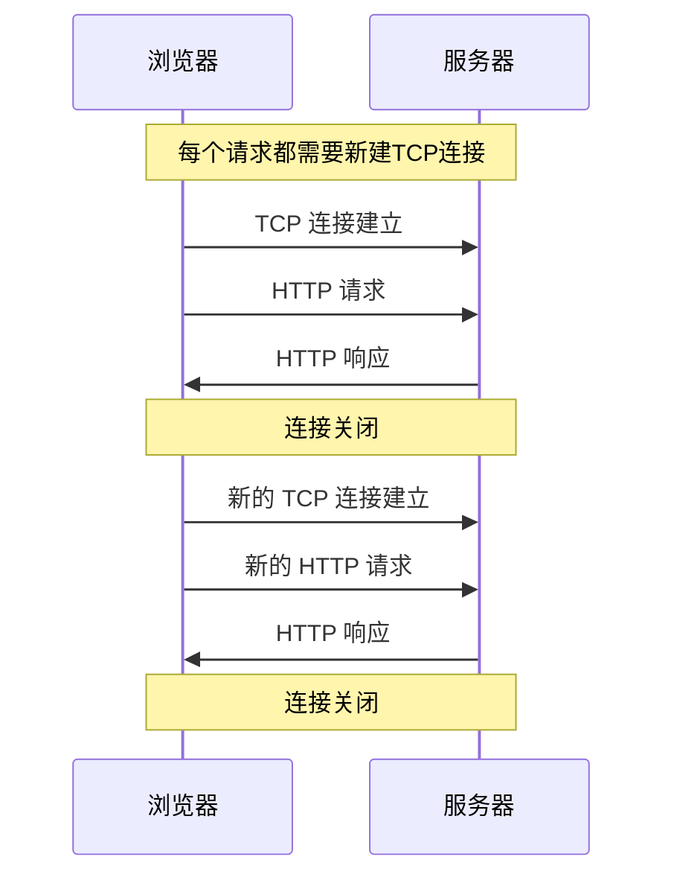
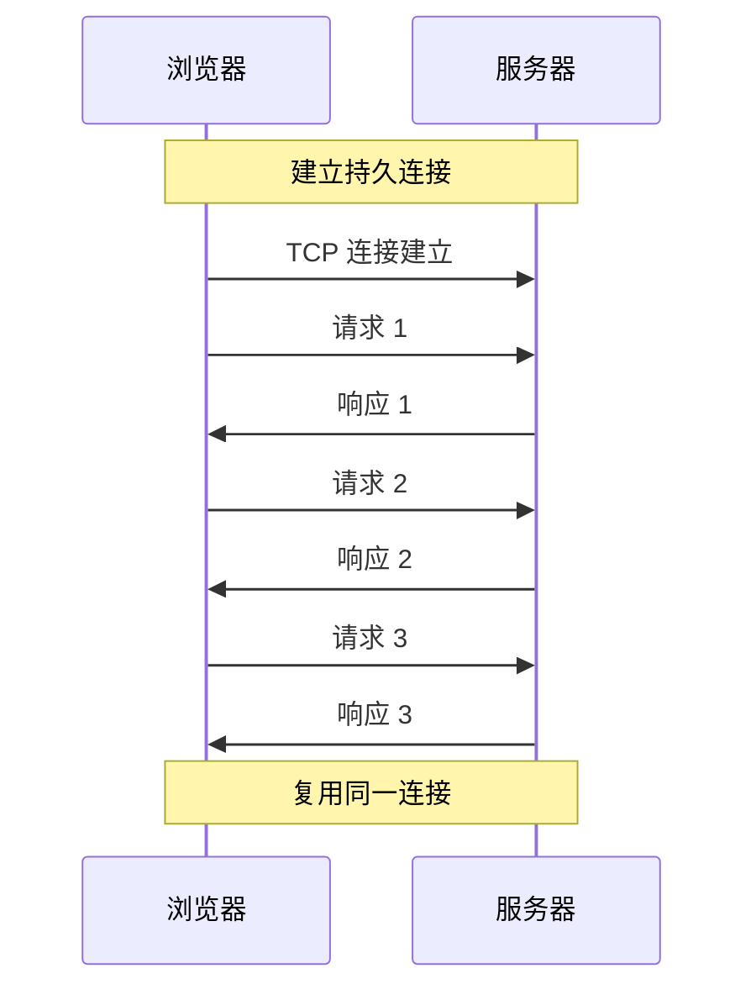
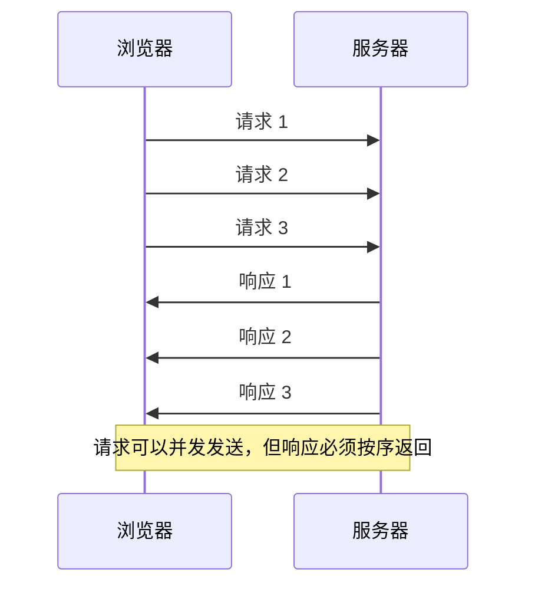
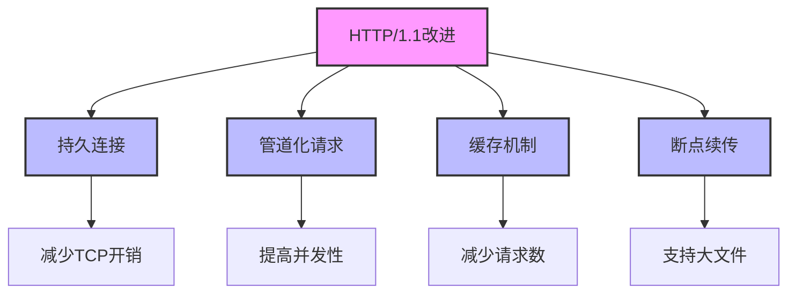
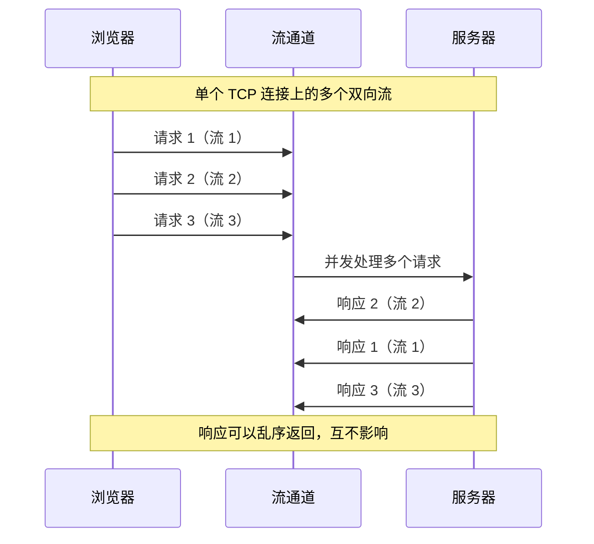
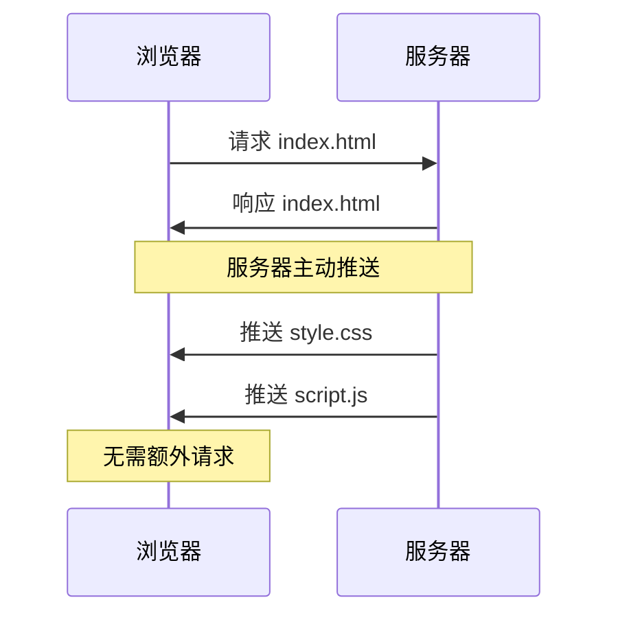
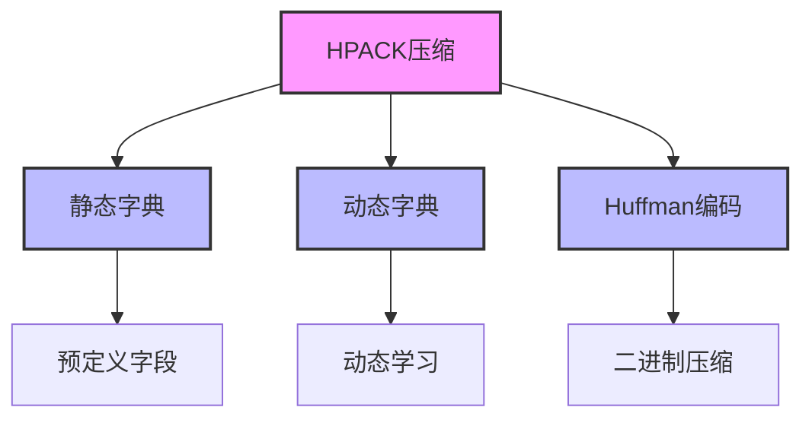
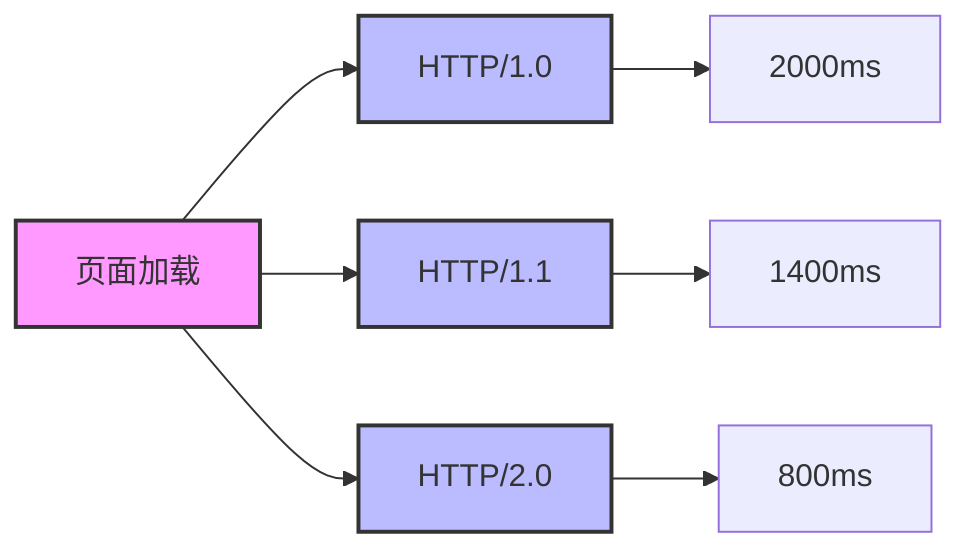
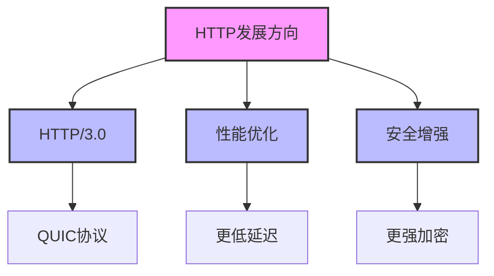

在互联网高速发展的今天，HTTP 协议作为 Web 的基石，经历了从 1.0 到 2.0 的重要演进。本文将通过图解和实例，带你深入理解这一演进过程中的关键技术创新和性能优化。

## HTTP 协议演进概览



## HTTP/1.0：Web 的第一步

### 1. 基本工作模式



### 2. 主要局限性

| 问题 | 影响 | 具体表现 |
|------|------|----------|
| 连接无法复用 | 性能开销大 | 每个请求都需要重新建立 TCP 连接 |
| 无状态协议 | 无法保存会话 | 需要额外机制维护用户状态 |
| 无压缩机制 | 带宽使用效率低 | 传输数据量大，速度慢 |

## HTTP/1.1：重要的优化

### 1. 持久连接机制



### 2. 管道化请求



### 3. 关键改进点



## HTTP/2.0：现代 Web 的基石

### 1. 多路复用



### 2. 服务器推送



### 3. 头部压缩



## 性能对比

### 1. 页面加载时间对比



### 2. 实际性能提升

| 特性 | HTTP/1.0 | HTTP/1.1 | HTTP/2.0 |
|------|----------|----------|----------|
| 连接复用 | ❌ | ✅ | ✅ |
| 头部压缩 | ❌ | ❌ | ✅ |
| 多路复用 | ❌ | 部分支持 | ✅ |
| 服务器推送 | ❌ | ❌ | ✅ |
| 优先级控制 | ❌ | ❌ | ✅ |

## 最佳实践

### 1. HTTP/2.0 优化建议

```javascript
// nginx 配置示例
http {
    server {
        listen 443 ssl http2;
        ssl_certificate /path/to/cert.pem;
        ssl_certificate_key /path/to/key.pem;
        
        # 启用服务器推送
        location / {
            http2_push /style.css;
            http2_push /script.js;
        }
        
        # 启用压缩
        gzip on;
        gzip_types text/plain text/css application/javascript;
    }
}
```

### 2. 性能优化建议

1. **合理使用服务器推送**
   - 推送关键资源
   - 避免过度推送
   - 考虑缓存策略

2. **优化头部压缩**
   - 减少自定义头部
   - 复用常用头部
   - 合理设置缓存

3. **利用多路复用**
   - 避免域名分片
   - 合理控制并发
   - 优化资源优先级

## 未来展望



## 参考资源

- [HTTP/2 简介](https://developers.google.com/web/fundamentals/performance/http2)
- [HTTP/2 规范](https://http2.github.io/)
- [NGINX HTTP/2 模块](https://nginx.org/en/docs/http/ngx_http_v2_module.html)
- [HTTP/2 性能优化](https://developers.google.com/web/fundamentals/performance/http2)

<ArticleFooter />