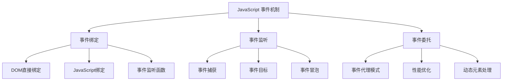
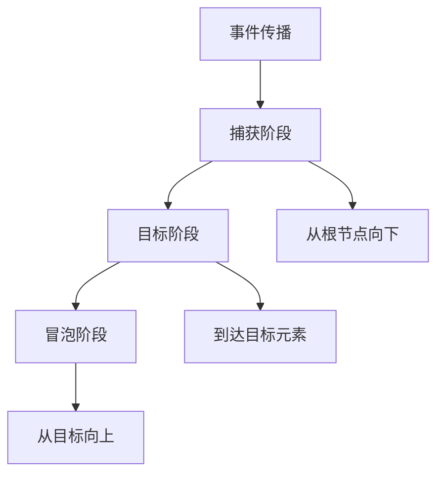
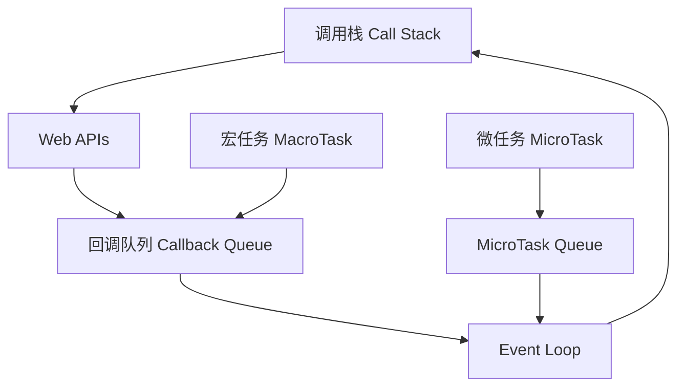
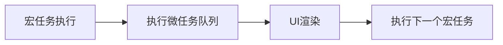

本文深入探讨 JavaScript 事件机制的核心概念，包括事件绑定、事件监听和事件委托。通过实例和最佳实践，帮助你全面掌握事件处理技术。

## 事件机制概述



## 事件绑定的三种方式

### 1. DOM 元素直接绑定
最简单但不推荐的方式：

```javascript
<button onclick="greet()">点击我</button>
<script>
function greet() {
    alert('Hello World!');
}
</script>
```

**缺点：**
- 耦合度高，不符合关注点分离原则
- 不易维护和扩展
- 可读性差

### 2. JavaScript 代码绑定
通过 JavaScript 为元素添加事件处理器：

```javascript
const button = document.getElementById('btn');
button.onclick = function() {
    alert('Hello World!');
};
```

**特点：**
- 分离了 HTML 和 JavaScript
- 只能绑定一个处理函数
- 无法控制事件触发阶段

### 3. 事件监听函数（推荐）
使用 addEventListener 方法：

```javascript
const button = document.getElementById('btn');
button.addEventListener('click', function() {
    alert('Hello World!');
}, false);
```

**优点：**
- 可以绑定多个事件处理函数
- 可以控制事件触发阶段
- 更好的可维护性和扩展性

## 事件流：捕获与冒泡

### 事件传播的三个阶段



### W3C 规范的事件流

事件流描述了页面中接收事件的顺序。事件传播有三个阶段：

1. **捕获阶段（Capturing Phase）**
   - 事件从 Window 对象开始向下传播
   - 经过目标节点的祖先节点
   - 直到到达目标节点的父节点

2. **目标阶段（Target Phase）**
   - 事件到达目标节点
   - 触发注册在目标节点上的事件处理程序

3. **冒泡阶段（Bubbling Phase）**
   - 事件从目标节点向上传播
   - 经过目标节点的祖先节点
   - 直到到达 Window 对象

### 事件监听器语法

```javascript
element.addEventListener(event, handler, useCapture);
```

**参数说明：**
- event: 事件名称（如 'click'）
- handler: 事件处理函数
- useCapture: 
  - true: 捕获阶段触发
  - false: 冒泡阶段触发（默认）

### 实际示例

```javascript
// 父元素
document.getElementById('parent').addEventListener('click', function(e) {
    console.log('父元素捕获阶段');
}, true);

document.getElementById('parent').addEventListener('click', function(e) {
    console.log('父元素冒泡阶段');
}, false);

// 子元素
document.getElementById('child').addEventListener('click', function(e) {
    console.log('子元素捕获阶段');
}, true);

document.getElementById('child').addEventListener('click', function(e) {
    console.log('子元素冒泡阶段');
}, false);
```

## 事件委托（Event Delegation）

### 原理与实现

事件委托利用事件冒泡，将事件处理器绑定到父元素上，统一处理子元素的事件。

```javascript
const list = document.getElementById('list');
list.addEventListener('click', function(e) {
    // 检查是否点击了列表项
    if (e.target.tagName === 'LI') {
        console.log('点击了列表项:', e.target.textContent);
    }
});
```

### 高级事件委托实现

```javascript
class EventDelegate {
    constructor(element, options = {}) {
        this.element = element;
        this.options = options;
        this.handlers = new Map();
    }

    on(eventType, selector, handler) {
        if (!this.handlers.has(eventType)) {
            this.handlers.set(eventType, new Map());
            this.addEventHandler(eventType);
        }
        this.handlers.get(eventType).set(selector, handler);
    }

    off(eventType, selector) {
        if (this.handlers.has(eventType)) {
            if (selector) {
                this.handlers.get(eventType).delete(selector);
            } else {
                this.handlers.delete(eventType);
            }
        }
    }

    addEventHandler(eventType) {
        this.element.addEventListener(eventType, (e) => {
            const handlers = this.handlers.get(eventType);
            if (!handlers) return;

            for (let [selector, handler] of handlers) {
                if (e.target.matches(selector)) {
                    handler.call(e.target, e);
                }
            }
        }, this.options.capture);
    }
}

// 使用示例
const delegate = new EventDelegate(document.body);
delegate.on('click', '.button', function(e) {
    console.log('按钮被点击:', this.textContent);
});
```

### 性能优化技巧

1. **选择合适的委托层级**
   - 避免委托到 document 或 body
   - 选择最近的公共父元素

2. **使用事件类型过滤**
   ```javascript
   function delegateEvent(parent, eventType, selector, handler) {
       const isCapture = ['focus', 'blur'].includes(eventType);
       
       parent.addEventListener(eventType, function(e) {
           const target = e.target;
           const currentTarget = e.currentTarget;
           let element = target;

           while (element && element !== currentTarget) {
               if (element.matches(selector)) {
                   handler.call(element, e);
                   break;
               }
               element = element.parentNode;
           }
       }, isCapture);
   }
   ```

3. **缓存选择器结果**
   ```javascript
   const cache = new WeakMap();
   
   function matchesSelector(element, selector) {
       if (!cache.has(element)) {
           cache.set(element, new Set());
       }
       const selectorCache = cache.get(element);
       
       if (!selectorCache.has(selector)) {
           selectorCache.add(selector);
           return element.matches(selector);
       }
       return true;
   }
   ```

## 最佳实践

1. **事件处理函数解耦**
   ```javascript
   // 不好的写法
   element.onclick = function(e) {
       // 大量的内联代码
   };

   // 好的写法
   function handleClick(e) {
       // 处理点击事件
   }
   element.addEventListener('click', handleClick);
   ```

2. **防止事件冒泡**
   ```javascript
   element.addEventListener('click', function(e) {
       e.stopPropagation();
       // 处理事件
   });
   ```

3. **移除事件监听器**
   ```javascript
   function cleanup() {
       element.removeEventListener('click', handleClick);
   }
   ```

## 调试技巧

```javascript
function debugEvent(e) {
    console.log({
        type: e.type,
        target: e.target,
        currentTarget: e.currentTarget,
        eventPhase: e.eventPhase,
        bubbles: e.bubbles,
        cancelable: e.cancelable,
        timeStamp: e.timeStamp
    });
}

// 使用方式
element.addEventListener('click', debugEvent);
```

## 浏览器兼容性

```javascript
function addEvent(element, type, handler) {
    if (element.addEventListener) {
        element.addEventListener(type, handler, false);
    } else if (element.attachEvent) {
        element.attachEvent('on' + type, handler);
    } else {
        element['on' + type] = handler;
    }
}

function removeEvent(element, type, handler) {
    if (element.removeEventListener) {
        element.removeEventListener(type, handler, false);
    } else if (element.detachEvent) {
        element.detachEvent('on' + type, handler);
    } else {
        element['on' + type] = null;
    }
}
```

## 参考资源

- [MDN - EventTarget.addEventListener()](https://developer.mozilla.org/zh-CN/docs/Web/API/EventTarget/addEventListener)
- [MDN - Event reference](https://developer.mozilla.org/zh-CN/docs/Web/Events)
- [JavaScript Event Delegation](https://davidwalsh.name/event-delegate)
- [Event Bubbling and Event Capturing](https://www.w3.org/TR/DOM-Level-3-Events/#event-flow)

## Event Loop 工作原理

JavaScript 是单线程的语言，但通过 Event Loop 机制实现了异步操作。让我们深入了解它的工作原理。

### Event Loop 基本概念



### 执行过程

1. **调用栈（Call Stack）**
   - 执行同步代码
   - 遇到异步任务时将其移交给 Web APIs
   - 继续执行栈中的其他代码

2. **Web APIs**
   - 处理异步操作（如定时器、事件监听、网络请求等）
   - 完成后将回调函数放入回调队列

3. **任务队列（Task Queue）**
   - 宏任务队列（MacroTask Queue）
     - setTimeout/setInterval 回调
     - I/O 操作
     - UI 渲染
   - 微任务队列（MicroTask Queue）
     - Promise.then/catch/finally
     - process.nextTick (Node.js)
     - MutationObserver

### 具体执行顺序

```javascript
console.log('1'); // 同步代码

setTimeout(() => {
    console.log('2'); // 宏任务
}, 0);

Promise.resolve().then(() => {
    console.log('3'); // 微任务
});

console.log('4'); // 同步代码

// 输出顺序：1, 4, 3, 2
```

### 事件循环与渲染时机



1. **渲染时机**
   - 每个宏任务执行完毕后
   - 微任务队列清空后
   - 浏览器判断是否需要渲染

2. **优化建议**
   ```javascript
   // 避免长时间占用主线程
   function longTask() {
       // 将长任务分割成小块
       const chunk = data.splice(0, 1000);
       if (chunk.length > 0) {
           processChunk(chunk);
           requestAnimationFrame(longTask);
       }
   }
   ```

### 常见问题和解决方案

1. **任务阻塞**
   ```javascript
   // 问题代码
   while (true) {
       // 死循环阻塞主线程
   }

   // 优化方案
   function processData(data, callback) {
       if (data.length === 0) {
           callback();
           return;
       }
       
       const chunk = data.splice(0, 1000);
       processChunk(chunk);
       
       setTimeout(() => {
           processData(data, callback);
       }, 0);
   }
   ```

2. **任务优先级**
   ```javascript
   // 高优先级任务使用微任务
   Promise.resolve().then(() => {
       // 重要的更新
   });

   // 低优先级任务使用宏任务
   setTimeout(() => {
       // 次要的更新
   }, 0);
   ```

3. **内存泄漏**
   ```javascript
   // 防止事件监听器累积
   function setupHandler() {
       const handler = () => {
           // 处理事件
       };
       
       element.addEventListener('click', handler);
       
       return () => {
           element.removeEventListener('click', handler);
       };
   }
   ```

### 性能优化建议

1. **合理使用微任务和宏任务**
   - 重要的更新使用微任务
   - 非关键操作使用宏任务
   - 避免微任务队列过长

2. **使用 requestAnimationFrame**
   ```javascript
   function animate() {
       // 更新动画
       requestAnimationFrame(animate);
   }
   ```

3. **使用 Web Workers**
   ```javascript
   // 主线程
   const worker = new Worker('worker.js');
   worker.postMessage({ data: complexData });
   worker.onmessage = (e) => {
       console.log('计算结果:', e.data);
   };

   // worker.js
   self.onmessage = (e) => {
       const result = complexCalculation(e.data);
       self.postMessage(result);
   };
   ```

## 参考资源

- [MDN - Event Loop](https://developer.mozilla.org/zh-CN/docs/Web/JavaScript/EventLoop)
- [Jake Archibald: In The Loop](https://www.youtube.com/watch?v=cCOL7MC4Pl0)
- [Philip Roberts: What the heck is the event loop anyway?](https://www.youtube.com/watch?v=8aGhZQkoFbQ)

<ArticleFooter />