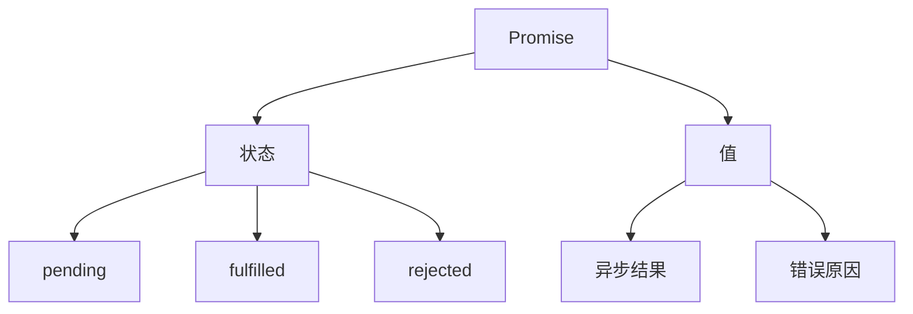

Promise 是 JavaScript 中处理异步操作的核心机制。本文将从原理到实践，全面解析 Promise 的工作机制，帮助你掌握异步编程的精髓。

## Promise 的本质

### 什么是 Promise？

Promise 是一个代表异步操作最终完成或失败的对象。它是一个容器，保存着未来才会结束的事件的结果，为异步操作提供了统一的 API。



### Promise 的特点

1. **状态不可逆**
   - pending -> fulfilled
   - pending -> rejected
   - 状态一旦改变，就不会再变

2. **值的不可变性**
   - 一旦 Promise 状态改变，其结果值就不能被改变
   - 即使多次调用 resolve 或 reject，只有第一次有效

3. **链式调用**
   - 支持通过 .then() 进行链式操作
   - 每个 .then() 都返回新的 Promise

## Promise 的基本用法

### 创建 Promise

```javascript
const promise = new Promise((resolve, reject) => {
  // 异步操作
  setTimeout(() => {
    const random = Math.random();
    if (random > 0.5) {
      resolve(\`成功: \${random}\`);
    } else {
      reject(\`失败: \${random}\`);
    }
  }, 1000);
});
```

### Promise 实例方法

#### 1. then()
处理 Promise 成功状态：

```javascript
promise.then(
  result => console.log('成功:', result),
  error => console.log('失败:', error)
);
```

#### 2. catch()
处理 Promise 失败状态：

```javascript
promise
  .then(result => console.log('成功:', result))
  .catch(error => console.log('失败:', error));
```

#### 3. finally()
无论成功失败都会执行：

```javascript
promise
  .then(result => console.log('成功:', result))
  .catch(error => console.log('失败:', error))
  .finally(() => console.log('清理工作'));
```

### Promise 静态方法

#### 1. Promise.all()
并行执行多个 Promise，全部成功才成功：

```javascript
const promises = [
  fetch('/api/user'),
  fetch('/api/posts'),
  fetch('/api/comments')
];

Promise.all(promises)
  .then(([user, posts, comments]) => {
    console.log('所有请求完成');
  })
  .catch(error => {
    console.log('任一请求失败:', error);
  });
```

#### 2. Promise.race()
返回最先完成的 Promise 结果：

```javascript
const timeout = new Promise((resolve, reject) => {
  setTimeout(() => reject('超时'), 5000);
});

const fetchData = fetch('/api/data');

Promise.race([fetchData, timeout])
  .then(result => console.log('成功获取数据'))
  .catch(error => console.log('请求失败或超时'));
```

#### 3. Promise.resolve() / Promise.reject()
快速创建已完成/已拒绝的 Promise：

```javascript
// 创建已完成的 Promise
const completed = Promise.resolve('直接完成');

// 创建已拒绝的 Promise
const failed = Promise.reject(new Error('直接失败'));
```

## 实际应用示例

### 1. 异步请求封装

```javascript
function request(url, options = {}) {
  return new Promise((resolve, reject) => {
    fetch(url, options)
      .then(response => {
        if (!response.ok) {
          throw new Error(\`HTTP error! status: \${response.status}\`);
        }
        return response.json();
      })
      .then(resolve)
      .catch(reject);
  });
}

// 使用示例
request('/api/data')
  .then(data => console.log('数据:', data))
  .catch(error => console.log('错误:', error));
```

### 2. 并发控制

```javascript
class RequestQueue {
  constructor(maxConcurrent = 5) {
    this.maxConcurrent = maxConcurrent;
    this.queue = [];
    this.running = 0;
  }

  add(promiseCreator) {
    return new Promise((resolve, reject) => {
      this.queue.push({ promiseCreator, resolve, reject });
      this.run();
    });
  }

  run() {
    while (this.running < this.maxConcurrent && this.queue.length) {
      const { promiseCreator, resolve, reject } = this.queue.shift();
      this.running++;

      promiseCreator()
        .then(resolve)
        .catch(reject)
        .finally(() => {
          this.running--;
          this.run();
        });
    }
  }
}
```

### 3. 超时处理

```javascript
function timeoutPromise(promise, timeout) {
  const timeoutP = new Promise((resolve, reject) => {
    setTimeout(() => reject(new Error('超时')), timeout);
  });

  return Promise.race([promise, timeoutP]);
}

// 使用示例
timeoutPromise(fetch('/api/data'), 5000)
  .then(response => response.json())
  .then(data => console.log('数据:', data))
  .catch(error => console.log('错误或超时:', error));
```

## 最佳实践

1. **错误处理**
   - 始终添加错误处理
   - 使用 catch 而不是 then 的第二个参数
   - 在 catch 后面可以继续链式调用

2. **Promise 链优化**
   - 保持 Promise 链的扁平化
   - 合理使用 return
   - 避免嵌套 Promise

3. **并发控制**
   - 使用 Promise.all 处理并行任务
   - 实现请求队列控制并发数
   - 注意内存泄漏问题

## 调试技巧

```javascript
function debugPromise(promise, name = 'Promise') {
  return promise
    .then(result => {
      console.log(\`\${name} 成功:`, result);
      return result;
    })
    .catch(error => {
      console.error(\`\${name} 失败:`, error);
      throw error;
    });
}
```

## 性能优化

1. **避免 Promise 链过长**
   - 使用 async/await 优化代码结构
   - 合并多个 Promise 操作

2. **合理使用 Promise.all**
   - 并行处理无依赖的异步操作
   - 注意错误处理机制

3. **缓存 Promise 结果**
   - 对于相同的请求进行缓存
   - 实现请求去重

## Promise 的实现原理

### 1. 基础版 Promise 实现

```javascript
class MyPromise {
  static PENDING = 'pending';
  static FULFILLED = 'fulfilled';
  static REJECTED = 'rejected';

  constructor(executor) {
    this.status = MyPromise.PENDING;
    this.value = undefined;
    this.reason = undefined;
    this.onFulfilledCallbacks = [];
    this.onRejectedCallbacks = [];

    try {
      executor(this.resolve.bind(this), this.reject.bind(this));
    } catch (error) {
      this.reject(error);
    }
  }

  resolve(value) {
    if (this.status === MyPromise.PENDING) {
      this.status = MyPromise.FULFILLED;
      this.value = value;
      this.onFulfilledCallbacks.forEach(fn => fn());
    }
  }

  reject(reason) {
    if (this.status === MyPromise.PENDING) {
      this.status = MyPromise.REJECTED;
      this.reason = reason;
      this.onRejectedCallbacks.forEach(fn => fn());
    }
  }

  then(onFulfilled, onRejected) {
    onFulfilled = typeof onFulfilled === 'function' ? onFulfilled : value => value;
    onRejected = typeof onRejected === 'function' ? onRejected : reason => { throw reason };

    const promise2 = new MyPromise((resolve, reject) => {
      if (this.status === MyPromise.FULFILLED) {
        setTimeout(() => {
          try {
            const x = onFulfilled(this.value);
            resolvePromise(promise2, x, resolve, reject);
          } catch (error) {
            reject(error);
          }
        });
      }

      if (this.status === MyPromise.REJECTED) {
        setTimeout(() => {
          try {
            const x = onRejected(this.reason);
            resolvePromise(promise2, x, resolve, reject);
          } catch (error) {
            reject(error);
          }
        });
      }

      if (this.status === MyPromise.PENDING) {
        this.onFulfilledCallbacks.push(() => {
          setTimeout(() => {
            try {
              const x = onFulfilled(this.value);
              resolvePromise(promise2, x, resolve, reject);
            } catch (error) {
              reject(error);
            }
          });
        });

        this.onRejectedCallbacks.push(() => {
          setTimeout(() => {
            try {
              const x = onRejected(this.reason);
              resolvePromise(promise2, x, resolve, reject);
            } catch (error) {
              reject(error);
            }
          });
        });
      }
    });

    return promise2;
  }
}

function resolvePromise(promise2, x, resolve, reject) {
  if (promise2 === x) {
    reject(new TypeError('Chaining cycle detected for promise'));
    return;
  }

  let called = false;

  if (x !== null && (typeof x === 'object' || typeof x === 'function')) {
    try {
      const then = x.then;

      if (typeof then === 'function') {
        then.call(
          x,
          value => {
            if (called) return;
            called = true;
            resolvePromise(promise2, value, resolve, reject);
          },
          reason => {
            if (called) return;
            called = true;
            reject(reason);
          }
        );
      } else {
        resolve(x);
      }
    } catch (error) {
      if (called) return;
      called = true;
      reject(error);
    }
  } else {
    resolve(x);
  }
}
```

### 2. 实现 Promise.all

```javascript
MyPromise.all = function(promises) {
  return new MyPromise((resolve, reject) => {
    if (!Array.isArray(promises)) {
      reject(new TypeError('promises must be an array'));
      return;
    }

    const results = [];
    let count = 0;
    const len = promises.length;

    if (len === 0) {
      resolve(results);
      return;
    }

    promises.forEach((promise, index) => {
      MyPromise.resolve(promise).then(
        value => {
          results[index] = value;
          count++;
          if (count === len) {
            resolve(results);
          }
        },
        reason => {
          reject(reason);
        }
      );
    });
  });
};
```

### 3. 实现 Promise.race

```javascript
MyPromise.race = function(promises) {
  return new MyPromise((resolve, reject) => {
    if (!Array.isArray(promises)) {
      reject(new TypeError('promises must be an array'));
      return;
    }

    promises.forEach(promise => {
      MyPromise.resolve(promise).then(resolve, reject);
    });
  });
};
```

### 4. 实现 Promise.resolve 和 Promise.reject

```javascript
MyPromise.resolve = function(value) {
  if (value instanceof MyPromise) {
    return value;
  }
  return new MyPromise(resolve => resolve(value));
};

MyPromise.reject = function(reason) {
  return new MyPromise((resolve, reject) => reject(reason));
};
```

### 5. Promise A+ 规范测试

要确保我们的 Promise 实现符合规范，可以使用 promises-aplus-tests 进行测试：

```javascript
// 添加 deferred 方法用于测试
MyPromise.deferred = function() {
  const deferred = {};
  deferred.promise = new MyPromise((resolve, reject) => {
    deferred.resolve = resolve;
    deferred.reject = reject;
  });
  return deferred;
};

module.exports = MyPromise;
```

运行测试：
```bash
npm install -g promises-aplus-tests
promises-aplus-tests myPromise.js
```

### 实现要点说明

1. **状态管理**
   - Promise 有三个状态：pending、fulfilled、rejected
   - 状态只能从 pending 转换到 fulfilled 或 rejected
   - 状态转换后不可再变

2. **异步处理**
   - 使用回调数组存储异步操作
   - 状态改变时执行对应的回调

3. **链式调用**
   - then 方法返回新的 Promise
   - 处理返回值的类型
   - 处理循环引用

4. **错误处理**
   - 捕获执行器错误
   - 处理回调中的异常
   - 支持异常传透

## 参考资源

- [MDN - Promise](https://developer.mozilla.org/zh-CN/docs/Web/JavaScript/Reference/Global_Objects/Promise)
- [Promises/A+ 规范](https://promisesaplus.com/)
- [JavaScript Promise 迷你书](http://liubin.org/promises-book/)
- [You Don't Know JS: Async & Performance](https://github.com/getify/You-Dont-Know-JS/blob/1st-ed/async%20%26%20performance/README.md)

<ArticleFooter />