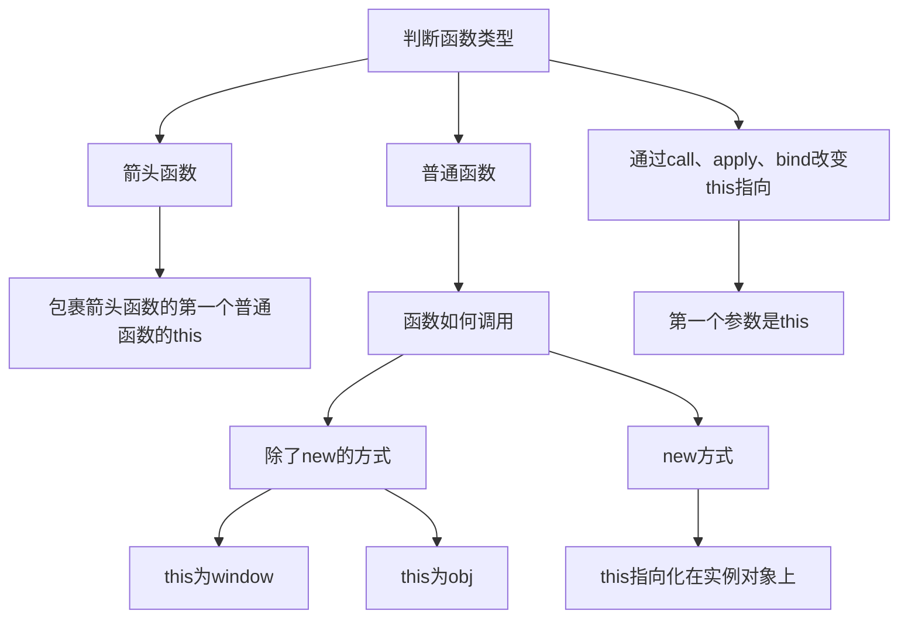

JavaScript 中的 `this` 是一个复杂而强大的概念。本文将从原理到实践，全面解析 `this` 的工作机制，帮助你彻底掌握这个关键概念。

## 函数 foo 中的 this 判断流程

要准确判断函数中的 this 指向，我们需要按照以下流程进行分析：



### 第一步：判断函数类型

首先，我们需要判断函数是以下三种类型之一：

#### 1. 箭头函数
- 箭头函数没有自己的 this
- this 值继承自包裹它的第一个普通函数的 this

```javascript
const obj = {
  foo: function() {      // 普通函数
    const arrow = () => {
      console.log(this); // this 继承自 foo，指向 obj
    };
    arrow();
  }
};
```

#### 2. 普通函数
需要继续判断函数如何调用：

```javascript
// 1. 直接调用 foo()
function foo() {
  console.log(this); // this 为 window
}
foo();

// 2. 作为对象方法调用 obj.foo()
const obj = {
  foo: function() {
    console.log(this); // this 指向 obj
  }
};
obj.foo();

// 3. new 方式调用
function Foo() {
  this.name = 'instance';
  console.log(this); // this 指向新创建的实例对象
}
new Foo();
```

#### 3. 通过 call、apply、bind 改变 this 指向
- this 指向第一个参数
- 如果第一个参数为 null 或 undefined，this 指向 window

```javascript
function foo() {
  console.log(this);
}
const obj = { name: 'obj' };

// call/apply 方式
foo.call(obj);     // this 指向 obj
foo.apply(obj);    // this 指向 obj

// bind 方式
const boundFoo = foo.bind(obj);
boundFoo();        // this 指向 obj
```

### 特殊情况处理

#### 1. this 绑定丢失
```javascript
const obj = {
  foo: function() {
    console.log(this);
  }
};

// 方法赋值给变量后调用
const { foo } = obj;
foo(); // this 为 window
```

#### 2. 嵌套函数中的 this
```javascript
const obj = {
  foo: function() {
    function inner() {
      console.log(this); // this 为 window
    }
    inner();
    
    // 使用箭头函数可以保持 this
    const innerArrow = () => {
      console.log(this); // this 指向 obj
    };
    innerArrow();
  }
};
```

## 最佳实践建议

1. **判断函数类型**
   - 是否是箭头函数
   - 是否是普通函数
   - 是否使用 call/apply/bind

2. **判断调用方式**
   - 直接调用 (foo())
   - 对象方法调用 (obj.foo())
   - new 调用
   - call/apply/bind 调用

3. **避免 this 绑定丢失**
   - 使用箭头函数
   - 使用 bind 绑定
   - 保存 this 引用 (const self = this)

## 调试技巧

```javascript
function debugThis() {
  console.log('当前 this 指向:', this);
  console.log('调用方式:', new.target ? 'new调用' : '普通调用');
  console.log('是否为严格模式:', (function() { return !this; }()));
}
```

## 参考资源

- [MDN - this](https://developer.mozilla.org/zh-CN/docs/Web/JavaScript/Reference/Operators/this)
- [You Don't Know JS: this & Object Prototypes](https://github.com/getify/You-Dont-Know-JS/blob/1st-ed/this%20%26%20object%20prototypes/README.md)

<ArticleFooter />
