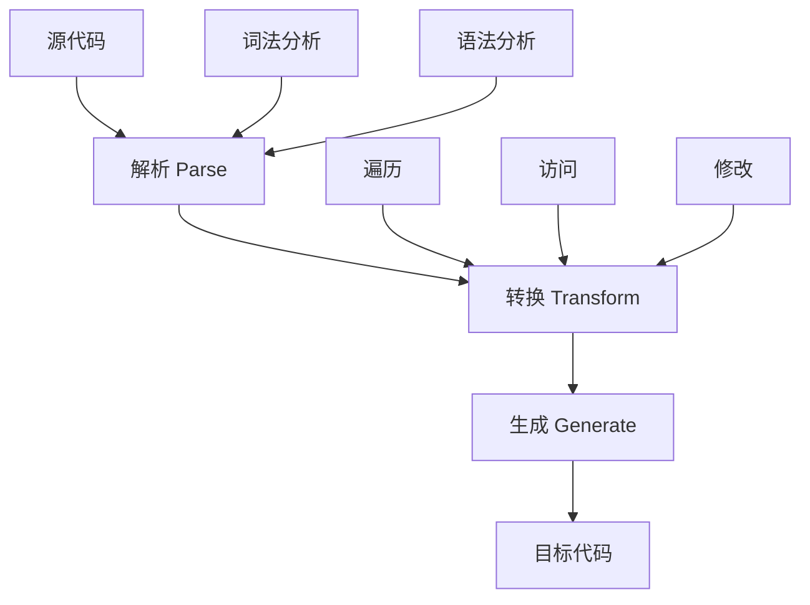

babel作为JavaScript现代编译器，在babel的编译过程中，我们可以编写一些插件来支持中间编译过程的产物转换。本文将从抽象语法树（AST）出发，深入解析整个编译转换过程，并通过实践案例帮助你掌握 babel 插件开发。

## Babel 的核心概念

### 什么是 Babel？

Babel 是一个 JavaScript 编译器，主要用于将 ECMAScript 2015+ 版本的代码转换为向后兼容的 JavaScript 语法，以便能够运行在当前和旧版本的浏览器或其他环境中。



### Babel 的主要功能

1. **语法转换**
   - ES6+ 语法转换为 ES5
   - JSX 转换为 JavaScript
   - TypeScript 转换为 JavaScript

2. **Polyfill 功能**
   - 添加目标环境缺少的特性
   - 通过 @babel/preset-env 按需加载

3. **源码转换**
   - 开发工具转换
   - 优化代码

## 抽象语法树（AST）详解

### 什么是 AST？

[AST](https://zh.wikipedia.org/wiki/%E6%8A%BD%E8%B1%A1%E8%AA%9E%E6%B3%95%E6%A8%B9)[维基百科]:在[计算机科学](https://zh.wikipedia.org/wiki/%E8%AE%A1%E7%AE%97%E6%9C%BA%E7%A7%91%E5%AD%A6)中，**抽象语法树**（**A**bstract **S**yntax **T**ree，AST），或简称**语法树**（Syntax tree），是[源代码](https://zh.wikipedia.org/wiki/%E6%BA%90%E4%BB%A3%E7%A0%81)[语法](https://zh.wikipedia.org/wiki/%E8%AF%AD%E6%B3%95%E5%AD%A6)结构的一种抽象表示。

### AST 的工作原理

AST 转换过程分为三个主要步骤：

1. **解析（Parsing）**
   - 词法分析：将代码字符串分割成 token 流
   - 语法分析：将 token 流转换成 AST

2. **转换（Transformation）**
   - 遍历 AST
   - 修改节点
   - 添加/删除/替换节点

3. **生成（Generation）**
   - 将转换后的 AST 转换回代码字符串
   - 生成 source map

### AST 实战示例

让我们通过一个简单的例子来理解 AST 的转换过程：

```javascript
// 原始代码
function ast() {}

// AST 转换过程
const esprima = require('esprima');    // 解析 js 语法
const estraverse = require('estraverse'); // 遍历树
const escodegen = require('escodegen');   // 生成新的树

let code = \`function ast(){}\`;

// 1. 解析
let tree = esprima.parseScript(code);

// 2. 遍历和修改
estraverse.traverse(tree, {
    enter(node) {
        if (node.type === 'Identifier') {
            node.name = 'Jomsou';
        }
    }
});

// 3. 生成
let result = escodegen.generate(tree);
console.log(result); // function Jomsou() {}
```

## Babel 插件开发实战

### 1. 箭头函数转换插件

#### 基础转换
将 ES6 箭头函数转换为 ES5 普通函数：

```javascript
const babel = require('babel-core');
const t = require('babel-types');

// 转换前：let sum = (a, b) => { return a + b };
let code = \`let sum = (a, b)=>{return a+b}\`;

let ArrowPlugins = {
    visitor: {
        ArrowFunctionExpression(path) {
            let { node } = path;
            let body = node.body;
            let params = node.params;
            let r = t.functionExpression(null, params, body, false, false);
            path.replaceWith(r);
        }
    }
}

let result = babel.transform(code, {
    plugins: [ArrowPlugins]
});
```

#### 处理简写形式
处理不带花括号的箭头函数：

```javascript
// 转换前：let sum = (a, b) => a + b;
let code = \`let sum = (a, b)=>a+b\`;

let ArrowPlugins = {
    visitor: {
        ArrowFunctionExpression(path) {
            let { node } = path;
            let params = node.params;
            let body = node.body;
            
            // 处理简写形式
            if (!t.isBlockStatement(body)) {
                let returnStatement = t.returnStatement(body);
                body = t.blockStatement([returnStatement]);
            }
            
            let func = t.functionExpression(null, params, body, false, false);
            path.replaceWith(func);
        }
    }
}
```

### 2. Class 转换插件

将 ES6 的 class 语法转换为 ES5 的构造函数：

```javascript
const babel = require('babel-core');
const t = require('babel-types');

let code = \`
class Jomsou {
    constructor(name) {
        this.name = name;
    }
    getName() {
        return this.name;
    }
}
\`;

let ClassPlugin = {
    visitor: {
        ClassDeclaration(path) {
            let { node } = path;
            let className = node.id.name;
            let classList = node.body.body;
            
            // 处理构造函数和方法
            let es5Functions = classList.map(item => {
                if (item.kind === 'constructor') {
                    return t.functionDeclaration(
                        t.identifier(className),
                        item.params,
                        item.body,
                        false,
                        false
                    );
                } else {
                    return t.expressionStatement(
                        t.assignmentExpression(
                            '=',
                            t.memberExpression(
                                t.memberExpression(
                                    t.identifier(className),
                                    t.identifier('prototype')
                                ),
                                t.identifier(item.key.name)
                            ),
                            t.functionExpression(null, item.params, item.body)
                        )
                    );
                }
            });
            
            path.replaceWithMultiple(es5Functions);
        }
    }
}
```

### 3. 按需加载插件

实现类似 babel-plugin-import 的功能：

```javascript
const babel = require('babel-core');
const t = require('babel-types');

let code = \`import { Button, Alert } from 'antd'\`;

let importPlugin = {
    visitor: {
        ImportDeclaration(path) {
            let { node } = path;
            let source = node.source.value;
            let specifiers = node.specifiers;
            
            if (!t.isImportDefaultSpecifier(specifiers[0])) {
                specifiers = specifiers.map(specifier => {
                    return t.importDeclaration(
                        [t.importDefaultSpecifier(specifier.local)],
                        t.stringLiteral(\`\${source}/lib/\${specifier.local.name.toLowerCase()}\`)
                    );
                });
                path.replaceWithMultiple(specifiers);
            }
        }
    }
}
```

## 性能优化建议

1. **避免重复遍历**
   - 合并多个访问器
   - 使用 path.skip() 跳过子节点

2. **减少 AST 节点操作**
   - 缓存常用节点
   - 避免不必要的节点创建

3. **优化访问器模式**
   - 使用具体的节点类型
   - 避免过度使用通配符

## 调试技巧

1. **使用 AST Explorer**
   - 在线查看 AST 结构
   - 实时验证转换结果

2. **日志调试**
   ```javascript
   visitor: {
       Identifier(path) {
           console.log('当前节点：', path.node);
           console.log('父节点：', path.parent);
       }
   }
   ```

## 最佳实践

1. **模块化设计**
   - 单一职责原则
   - 可复用的转换逻辑

2. **错误处理**
   - 添加类型检查
   - 优雅的错误提示

3. **测试用例**
   - 单元测试
   - 集成测试

## 参考资源

- [Babel 官方文档](https://babeljs.io/docs/en/)
- [AST Explorer](https://astexplorer.net/)
- [Babel Plugin Handbook](https://github.com/jamiebuilds/babel-handbook/blob/master/translations/en/plugin-handbook.md)
- [Esprima](http://esprima.org/)
- [babel在github上的文档](https://github.com/babel/babel/tree/6.x/packages/babel-types)

原文：[从AST编译解析谈到写babel插件](https://github.com/Zenquan/blog/issues/13)，欢迎 star，欢迎交流。

项目地址：[babelPlugin](https://github.com/Zenquan/babelPlugin)

<ArticleFooter />