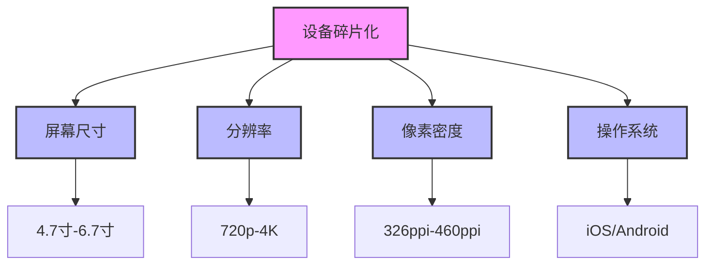
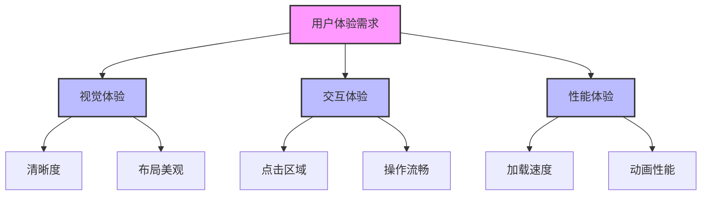
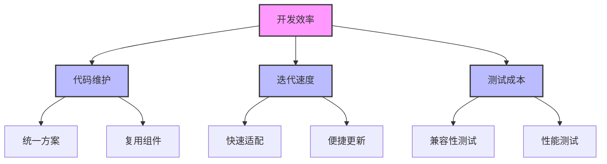
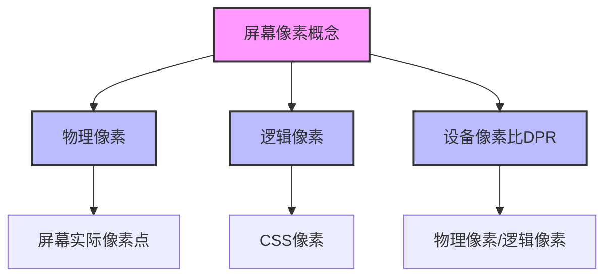
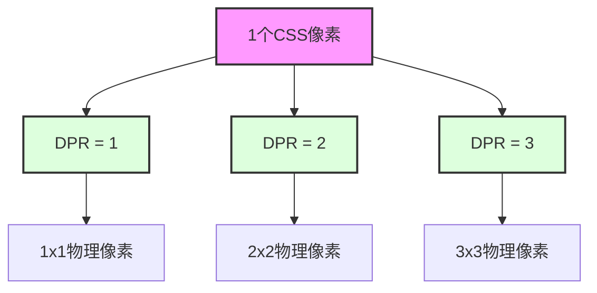
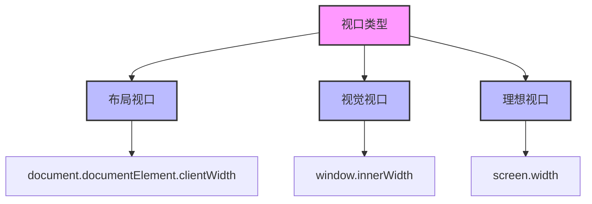

在移动互联网时代，设备尺寸的碎片化使得响应式布局变得至关重要。本文将深入探讨移动端适配方案，从基础概念到进阶实践，帮助你构建完美适配各种移动设备的 Web 应用。

## 为什么需要移动端适配？

### 1. 设备碎片化问题



移动设备的多样性带来了巨大的适配挑战：
1. **屏幕尺寸差异**：从小屏手机到大屏平板，尺寸跨度巨大
2. **分辨率多样**：不同档位设备分辨率差异显著
3. **像素密度不一**：影响实际显示效果和清晰度
4. **系统差异**：不同平台渲染表现存在差异

### 2. 用户体验要求



良好的适配直接影响用户体验：
1. **视觉体验**
   - 内容在不同设备上清晰展示
   - 布局结构合理美观
   - 品牌形象保持一致

2. **交互体验**
   - 点击区域大小适中
   - 手势操作流畅自然
   - 表单输入便捷

3. **性能体验**
   - 页面加载速度快
   - 动画过渡流畅
   - 内存占用合理

### 3. 开发效率考虑



合适的适配方案能够：
1. **提升开发效率**
   - 统一的开发标准
   - 可复用的组件系统
   - 自动化的适配工具

2. **降低维护成本**
   - 集中管理适配代码
   - 便于问题定位修复
   - 减少重复工作

3. **加快迭代速度**
   - 快速响应需求变更
   - 便捷进行界面调整
   - 高效进行多端适配

### 4. 业务价值

| 适配效果 | 业务影响 | 具体表现 |
|---------|----------|----------|
| 提升转化率 | 直接收益 | 用户更容易完成目标操作 |
| 提升留存 | 长期价值 | 用户体验好，愿意持续使用 |
| 品牌形象 | 间接价值 | 专业、精致的品牌印象 |
| 市场竞争 | 战略价值 | 在移动端的竞争优势 |

## 移动端适配基础概念

### 1. 物理像素与逻辑像素



#### 设备像素比(DPR)示意图



### 2. 视口(Viewport)概念



## 主流适配方案详解

### 1. Viewport 适配方案

```javascript
// meta viewport 配置
<meta name="viewport" content="width=device-width, initial-scale=1.0, maximum-scale=1.0, user-scalable=no">
```

**优势：**
- 直观简单
- 无需复杂计算
- 适合简单的响应式需求

**劣势：**
- 不够灵活
- 无法精确控制缩放
- 可能存在兼容性问题

### 2. vw/vh 方案

```scss
// 使用 vw 进行适配
.container {
    width: 100vw;
    height: 100vh;
    font-size: 4vw;
}

// 结合 calc 使用
.element {
    width: calc(100vw - 20px);
    padding: calc(5vw + 10px);
}
```

**优势：**
- 更符合直觉
- 计算简单
- 原生支持
- 无需 JavaScript

**劣势：**
- IE 支持性差
- 无法设置最大最小值
- 部分机型存在兼容问题

### 3. 百分比布局

```scss
.parent {
    width: 100%;
    
    .child {
        width: 50%;  // 相对父元素宽度
        height: 0;
        padding-bottom: 50%;  // 实现正方形
    }
}
```

**优势：**
- 原生支持
- 无需额外工具
- 适合流式布局

**劣势：**
- 高度设置困难
- 计算复杂
- 无法统一控制

### 4. 弹性布局（Flexbox）

```scss
.container {
    display: flex;
    flex-wrap: wrap;
    
    .item {
        flex: 0 0 50%;  // 两列布局
        // 或者使用 calc
        flex: 0 0 calc(50% - 10px);  // 考虑间距
    }
}
```

**优势：**
- 灵活强大
- 容易居中
- 支持复杂布局

**劣势：**
- 需要考虑兼容性
- 不适合整体缩放
- 学习成本较高

### 5. Grid 布局

```scss
.container {
    display: grid;
    grid-template-columns: repeat(auto-fit, minmax(150px, 1fr));
    gap: 20px;
}
```

**优势：**
- 二维布局强大
- 响应式友好
- 代码简洁

**劣势：**
- 兼容性要求高
- 不适合复杂的自适应
- 学习曲线陡峭

## 多方案协同最佳实践

### 1. 混合使用示例

```scss
.container {
    // 使用 rem 控制整体缩放
    width: px2rem(750px);
    
    // 内部使用 flex 布局
    display: flex;
    justify-content: space-between;
    
    .item {
        // 使用 vw 控制大小
        width: 30vw;
        
        // 文字使用 px
        font-size: 16px;
        
        // 使用 transform 处理 1px 问题
        border: 0.5px solid #000;
        @media (-webkit-min-device-pixel-ratio: 2) {
            border-width: 0.5px;
        }
    }
}
```

### 2. 响应式断点设置

```scss
// 断点管理
$breakpoints: (
    'phone': 320px,
    'tablet': 768px,
    'desktop': 1024px
);

// 混合宏
@mixin respond-to($breakpoint) {
    $value: map-get($breakpoints, $breakpoint);
    
    @media screen and (min-width: $value) {
        @content;
    }
}

// 使用示例
.element {
    font-size: px2rem(28px);
    
    @include respond-to('tablet') {
        font-size: px2rem(32px);
    }
    
    @include respond-to('desktop') {
        font-size: px2rem(36px);
  }
}
```

## 参考资源

- [MDN - rem 单位](https://developer.mozilla.org/zh-CN/docs/Web/CSS/length)
- [使用 Flexible 实现手淘 H5 页面的终端适配](https://github.com/amfe/article/issues/17)
- [PostCSS pxtorem 插件](https://github.com/cuth/postcss-pxtorem)
- [移动端适配方案对比](https://juejin.cn/post/6844903630655471624)

<ArticleFooter />