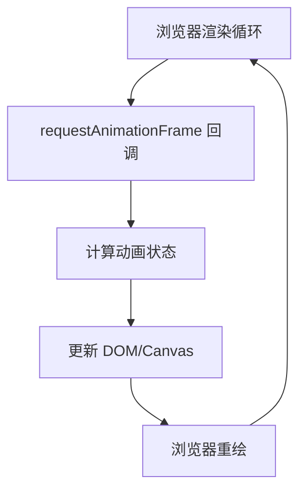

最近打算研究一下canvas，然后就遇到要写动画，那么就遇到了requestAnimationFrame。本文将从底层的 requestAnimationFrame 开始，全面介绍前端动画的实现方案，帮助你选择最适合的动画解决方案。

## 前端动画实现方案概览

在深入了解具体实现之前，让我们先看看前端实现动画的几种主要方式：

1. **CSS 动画**
   - CSS Transitions
   - CSS Animations
   - CSS Transform
2. **JavaScript 动画**
   - setTimeout/setInterval
   - requestAnimationFrame
3. **现代动画库**
   - Motion
   - Animate.css
   - GSAP
   - Framer Motion
4. **Canvas/WebGL 动画**
   - 2D Canvas
   - Three.js
   - WebGL

## requestAnimationFrame：浏览器动画的核心 API

### 什么是 requestAnimationFrame？

来自MDN的解释：**window.requestAnimationFrame()** 告诉浏览器——你希望执行一个动画，并且要求浏览器在下次重绘之前调用指定的回调函数更新动画。该方法需要传入一个回调函数作为参数，该回调函数会在浏览器下一次重绘之前执行。



### 为什么存在？优点缺点？

requestAnimationFrame是浏览器用于定时循环操作的一个接口，类似于setTimeout，主要用途是按帧对网页进行重绘。

设置这个API的目的是为了让各种网页动画效果（DOM动画、Canvas动画、SVG动画、WebGL动画）能够有一个统一的刷新机制，从而节省系统资源，提高系统性能，改善视觉效果。代码中使用这个API，就是告诉浏览器希望执行一个动画，让浏览器在下一个动画帧安排一次网页重绘。

#### 优点：
1. **同步屏幕刷新率**
   - 自动适应显示器刷新频率（通常是 60Hz 或 75Hz）
   - 确保动画帧与屏幕刷新同步，避免掉帧
   
2. **性能优化**
   - 在页面不可见时自动暂停，节省系统资源
   - 优化电池寿命，特别是在移动设备上
   
3. **更好的时间控制**
   - 提供精确的时间戳参数
   - 自动处理帧率控制

4. **天然的函数节流**
   - 在高频率事件(resize, scroll等)中自动节流
   - 保证每个刷新间隔内函数只执行一次
   - 避免不必要的性能损耗
   - 提供更流畅的视觉效果

这种基于 requestAnimationFrame 的节流方式相比传统的 setTimeout/setInterval 实现有以下优势：

1. **同步屏幕刷新**
   - 确保更新时机与屏幕刷新同步
   - 避免中间帧的无效计算

2. **更好的性能**
   - 浏览器可以优化并批量处理视觉更新
   - 后台标签页自动暂停，节省资源

3. **更精确的时间控制**
   - 不受 setTimeout 最小间隔时间的限制
   - 能更好地适应不同刷新率的设备

4. **自动优化**
   - 浏览器可以根据设备性能自动调整
   - 在低性能设备上自动降低更新频率

#### 函数节流示例
```javascript
// 传统的节流实现
function throttle(func, limit) {
    let inThrottle;
    return function() {
        const args = arguments;
        const context = this;
        if (!inThrottle) {
            func.apply(context, args);
            inThrottle = true;
            setTimeout(() => inThrottle = false, limit);
        }
    }
}

// 使用 throttle
window.addEventListener('scroll', throttle(() => {
    console.log('滚动事件触发');
}, 16.7));

// 使用 requestAnimationFrame 实现节流
function rafThrottle(func) {
    let ticking = false;
    
    return function() {
        const context = this;
        const args = arguments;
        
        if (!ticking) {
            requestAnimationFrame(() => {
                func.apply(context, args);
                ticking = false;
            });
            ticking = true;
        }
    };
}

// 使用 rafThrottle
window.addEventListener('scroll', rafThrottle(() => {
    console.log('滚动事件触发');
    // 执行动画相关操作
    updateAnimation();
}));

// 实际应用示例：滚动进度条
function createScrollProgress() {
    const progressBar = document.querySelector('.progress-bar');
    
    const updateProgress = rafThrottle(() => {
        const scrollTop = window.scrollY;
        const docHeight = document.documentElement.scrollHeight - window.innerHeight;
        const progress = (scrollTop / docHeight) * 100;
        
        progressBar.style.width = \`\${progress}%\`;
    });
    
    window.addEventListener('scroll', updateProgress);
}

#### 缺点：
- requestAnimationFrame是在主线程上完成。这意味着，如果主线程非常繁忙，requestAnimationFrame的动画效果会大打折扣。
- 需要手动管理动画状态
- 不如现代动画库使用方便

### 基本使用

#### 语法
```javascript
window.requestAnimationFrame(callback);
```

### setTimeout 动画实现分析

在 requestAnimationFrame 出现之前，setTimeout 是实现 JavaScript 动画最常用的方式。让我们深入分析它的优缺点：

#### setTimeout 动画原理
```javascript
function animate() {
    element.style.left = parseInt(element.style.left) + 1 + 'px';
    setTimeout(animate, 16.7); // 尝试匹配 60fps
}
setTimeout(animate, 16.7);
```

#### 优点：
1. **简单直观**
   - 实现方式简单，容易理解
   - 可以精确控制动画间隔时间
   - 广泛的浏览器支持

2. **灵活性**
   - 可以实现复杂的动画逻辑
   - 能够在动画过程中轻松改变参数
   - 可以实现非线性的时间间隔

#### 缺点：
1. **定时不准确**
   - setTimeout 任务被放入异步队列，需要等待主线程任务执行完成
   - 实际执行时间往往比设定时间要晚
   - 受主线程繁忙程度影响较大

2. **丢帧问题**
   - setTimeout 的固定时间间隔不一定与屏幕刷新时间同步
   - 可能在一个刷新间隔内执行多次，造成丢帧
   - 或者错过刷新时机，导致动画不流畅

3. **性能问题**
   - 即使页面不可见，后台标签页中的 setTimeout 仍然会执行
   - 耗费不必要的系统资源和电量
   - 多个动画同时执行时，难以优化和同步

4. **时间间隔限制**
   - 浏览器对 setTimeout 的最小间隔时间有限制（通常是4ms）
   - 无法完全匹配屏幕刷新率
   - 在高刷新率显示器上表现欠佳

#### 示例对比
```javascript
// setTimeout 实现
function animateWithTimeout() {
    const element = document.getElementById('box');
    let position = 0;
    
    function move() {
        position += 2;
        element.style.transform = `translateX(${position}px)`;
        
        if (position < 600) {
            setTimeout(move, 16.7); // 尝试模拟 60fps
        }
    }
    
    setTimeout(move, 16.7);
}

// requestAnimationFrame 实现
function animateWithRAF() {
    const element = document.getElementById('box');
    let position = 0;
    
    function move() {
        position += 2;
        element.style.transform = `translateX(${position}px)`;
        
        if (position < 600) {
            requestAnimationFrame(move);
        }
    }
    
    requestAnimationFrame(move);
}
```

这个对比清楚地展示了两种方式的实现差异。requestAnimationFrame 的实现更加简洁，并且能够自动与屏幕刷新同步，而 setTimeout 需要手动设置时间间隔，且可能造成丢帧或性能问题。

#### 1. 基础动画示例
```javascript
let start;

function animate(timestamp) {
  if (!start) start = timestamp;
  const progress = timestamp - start;

  // 移动元素
  element.style.transform = \`translateX(\${Math.min(progress / 10, 200)}px)\`;

  // 在 200px 内继续动画
  if (progress < 2000) {
    requestAnimationFrame(animate);
  }
}

requestAnimationFrame(animate);
```

#### 2. Canvas 动画示例
```javascript
const canvas = document.getElementById('canvas')
const ctx = canvas.getContext('2d')
let W = canvas.width = 800
let H = canvas.height = 600

const ball = new Ball({
    x: W/2,
    y: H/2,
    r: 50
}).render(ctx)

let angle = 0
const SWING = 160; // 振幅

function animate() {
    requestAnimationFrame(animate)
    
    ctx.clearRect(0, 0, W, H);
    ball.x = W/2 + Math.sin(angle) * SWING;
    
    angle += 0.05
    angle %= Math.PI * 2
    ball.render(ctx)
}

animate();
```

## 现代动画解决方案

### 1. Motion 库
[Motion](https://motion.dev/) 是一个强大的 React 动画库，提供了简单易用的 API 和出色的性能。

```jsx
import { motion } from "motion/react"

// 简单的动画示例
function AnimatedButton() {
  return (
    <motion.button
      whileHover={{ scale: 1.1 }}
      whileTap={{ scale: 0.95 }}
      initial={{ opacity: 0 }}
      animate={{ opacity: 1 }}
    >
      点击我
    </motion.button>
  )
}

// 滚动触发动画
function ScrollAnimation() {
  return (
    <motion.div
      initial={{ opacity: 0, y: 50 }}
      whileInView={{ opacity: 1, y: 0 }}
      transition={{ duration: 0.5 }}
    >
      滚动到视图时显示
    </motion.div>
  )
}
```

### 2. Animate.css
[Animate.css](https://animate.style/) 是一个跨浏览器的 CSS 动画库，提供了丰富的预设动画效果。

```html
<!-- 引入 Animate.css -->
<link rel="stylesheet" href="https://cdnjs.cloudflare.com/ajax/libs/animate.css/4.1.1/animate.min.css"/>

<!-- 使用动画类 -->
<div class="animate__animated animate__bounce">
  弹跳效果
</div>
```

```jsx
// 在 React 中使用
function AnimatedComponent() {
  return (
    <div className="animate__animated animate__fadeInUp">
      淡入上升效果
    </div>
  )
}
```

## 性能优化建议

1. **选择合适的动画实现方式**
   - 简单动画：使用 CSS 动画
   - 复杂交互：使用 JavaScript 动画
   - 大量元素：考虑使用 Canvas

2. **优化技巧**
   - 使用 transform 和 opacity 属性（触发合成层）
   - 避免同时动画过多元素
   - 使用 will-change 提示浏览器
   - 在适当时机暂停动画

3. **性能监控**
   - 使用 Chrome DevTools Performance 面板
   - 监控帧率（FPS）
   - 检查布局抖动

## 浏览器兼容性处理

优雅降级：由于兼容性问题，需要降级对接口进行封装，优先使用高级特性，再根据浏览器不同情况进行回退，直到只能使用settimeout。

```javascript
// requestAnimationFrame polyfill
if (!Date.now)
    Date.now = function() { return new Date().getTime(); };

(function() {
    'use strict';
    
    var vendors = ['webkit', 'moz'];
    for (var i = 0; i < vendors.length && !window.requestAnimationFrame; ++i) {
        var vp = vendors[i];
        window.requestAnimationFrame = window[vp+'RequestAnimationFrame'];
        window.cancelAnimationFrame = (window[vp+'CancelAnimationFrame']
                                   || window[vp+'CancelRequestAnimationFrame']);
    }
    if (/iP(ad|hone|od).*OS 6/.test(window.navigator.userAgent) // iOS6 is buggy
        || !window.requestAnimationFrame || !window.cancelAnimationFrame) {
        var lastTime = 0;
        window.requestAnimationFrame = function(callback) {
            var now = Date.now();
            var nextTime = Math.max(lastTime + 16, now);
            return setTimeout(function() { callback(lastTime = nextTime); },
                              nextTime - now);
        };
        window.cancelAnimationFrame = clearTimeout;
    }
}());
```

## 总结

实现动画效果的方法比较多，Javascript 中可以通过定时器 setTimeout 来实现，css3 可以使用 transition 和 animation 来实现，html5 中的 canvas 也可以实现。除此之外，html5 还提供一个专门用于请求动画的API，那就是 requestAnimationFrame，顾名思义就是**请求动画帧。**

1. **屏幕刷新频率**：屏幕每秒出现图像的次数。普通笔记本为60Hz
2. **动画原理**：计算机每16.7ms刷新一次，由于人眼的视觉停留，所以看起来是流畅的移动。
3. **setTimeout**：通过设定间隔时间来不断改变图像位置，达到动画效果。但是容易出现卡顿、抖动的现象；原因是：1、settimeout任务被放入异步队列，只有当主线程任务执行完后才会执行队列中的任务，因此实际执行时间总是比设定时间要晚；2、settimeout的固定时间间隔不一定与屏幕刷新时间相同，会引起丢帧。
4. **requestAnimationFrame优势**：由系统决定回调函数的执行时机。60Hz的刷新频率，那么每次刷新的间隔中会执行一次回调函数，不会引起丢帧，不会卡顿。

### 最佳实践

在现代前端开发中，我们应该根据不同场景选择合适的动画方案：

1. **简单动画场景**
   - 使用 CSS 动画或 Animate.css
   - 性能好，实现简单

2. **复杂交互动画**
   - 使用 Motion 或其他现代动画库
   - 提供丰富的 API 和更好的控制力

3. **高性能动画需求**
   - 使用 requestAnimationFrame
   - 结合 Canvas 或 WebGL
   - 适合游戏或数据可视化场景

选择合适的动画方案时，需要考虑：
- 项目需求的复杂度
- 性能要求
- 浏览器兼容性
- 开发效率
- 维护成本

## 参考资源

- [Motion 官方文档](https://motion.dev/docs/react-quick-start)
- [Animate.css](https://animate.style/)
- [MDN - requestAnimationFrame](https://developer.mozilla.org/zh-CN/docs/Web/API/window/requestAnimationFrame)
- [CSS Triggers](https://csstriggers.com/)

<ArticleFooter />