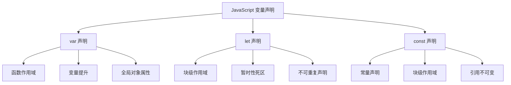

本文深入探讨 JavaScript 中的变量声明方式，帮助你理解 var、let 和 const 的区别，以及在实际开发中如何选择合适的声明方式。

## 变量声明概述



## 块级作用域

### 基本概念
块级作用域是 ES6 引入的重要特性，let 和 const 声明的变量仅在其声明所在的块级作用域内有效。

```javascript
{
    let a = 1;
    var b = 1;
    const c = 1;
}
console.log(b);      // 1
console.log(a);      // ReferenceError: a is not defined
console.log(c);      // ReferenceError: c is not defined
```

### 实际应用场景

1. **循环中的计数器**
```javascript
// ES6 之前的问题
for (var i = 0; i < 4; i++) {
    setTimeout(() => {
        console.log(i);
    }, 300);
} // 输出: 4 4 4 4

// 使用 let 的正确方式
for (let i = 0; i < 4; i++) {
    setTimeout(() => {
        console.log(i);
    }, 300);
} // 输出: 0 1 2 3
```

2. **替代 IIFE**
```javascript
// ES5 的 IIFE
(function() {
    var tmp = '...';
    // ...
})();

// ES6 的块级作用域
{
    let tmp = '...';
    // ...
}
```

## 变量提升与暂时性死区

### 变量提升
var 声明的变量存在提升现象，而 let 和 const 不会。

```javascript
// 使用 var
console.log(a);  // undefined
var a = 1;

// 使用 let
console.log(b);  // ReferenceError: b is not defined
let b = 1;
```

### 暂时性死区（TDZ）
在代码块内，使用 let 或 const 声明的变量，从一开始就形成了封闭作用域。在声明之前使用这些变量，就会报错。

```javascript
// TDZ 示例
var tmp = 123;
if (true) {
    tmp = 'abc';    // ReferenceError
    let tmp;
}

// 函数参数的 TDZ
function bar(x = y, y = 2) {
    return [x, y];
}
bar();  // ReferenceError: y is not defined

// 正确的参数声明顺序
function bar(x = 2, y = x) {
    return [x, y];
}
bar();  // [2, 2]
```

## 重复声明限制

### var 的重复声明
```javascript
var a = 1;
var a = 2;  // 允许，a = 2

function func(arg) {
    var arg;  // 允许
}
```

### let 和 const 的限制
```javascript
let a = 1;
let a = 2;  // SyntaxError: Identifier 'a' has already been declared

function func(arg) {
    let arg;  // SyntaxError
}

// 不同作用域可以声明同名变量
function func(arg) {
    {
        let arg;  // 允许，新的作用域
    }
}
```

## 全局对象属性

### var 的全局声明
```javascript
var globalVar = 'global';
console.log(window.globalVar);  // 'global'
```

### let 和 const 的全局声明
```javascript
let globalLet = 'global';
const globalConst = 'global';
console.log(window.globalLet);     // undefined
console.log(window.globalConst);   // undefined
```

## let 与 const 的区别

### 1. 值的可变性
```javascript
// let 声明的变量可以重新赋值
let count = 1;
count = 2;  // 允许

// const 声明的变量不可重新赋值
const MAX_COUNT = 1;
MAX_COUNT = 2;  // TypeError: Assignment to constant variable
```

### 2. 对象属性的可变性
```javascript
const user = {
    name: 'John',
    age: 30
};

// 允许修改对象的属性
user.age = 31;  // 正常工作

// 但不能重新赋值整个对象
user = { name: 'Jane' };  // TypeError: Assignment to constant variable
```

### 3. 最佳实践
```javascript
// 使用 const 声明对象
const config = {
    api: 'https://api.example.com',
    timeout: 3000
};

// 使用 Object.freeze 实现深度不可变
const frozenConfig = Object.freeze({
    api: 'https://api.example.com',
    timeout: 3000
});
```

## 选择建议

1. **默认使用 const**
   - 如果一个值不需要重新赋值，就使用 const
   - 可以避免意外的重新赋值
   - 提高代码的可维护性

2. **需要重新赋值时使用 let**
   - 循环计数器
   - 累加器
   - 状态标志

3. **避免使用 var**
   - 函数作用域容易导致问题
   - 变量提升使代码难以理解
   - 没有块级作用域的限制

## 调试技巧

```javascript
// 使用 console.log 查看变量声明位置
function debugScope() {
    console.log('1. var:', typeof varVariable);
    console.log('2. let:', typeof letVariable);
    
    var varVariable = 'var';
    let letVariable = 'let';
    
    console.log('3. var:', typeof varVariable);
    console.log('4. let:', typeof letVariable);
}
```

## 参考资源

- [MDN - let](https://developer.mozilla.org/zh-CN/docs/Web/JavaScript/Reference/Statements/let)
- [MDN - const](https://developer.mozilla.org/zh-CN/docs/Web/JavaScript/Reference/Statements/const)
- [ES6 标准入门 - 变量的解构赋值](https://es6.ruanyifeng.com/#docs/destructuring)

<ArticleFooter />