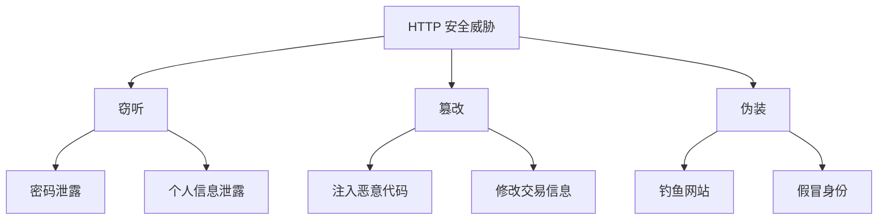
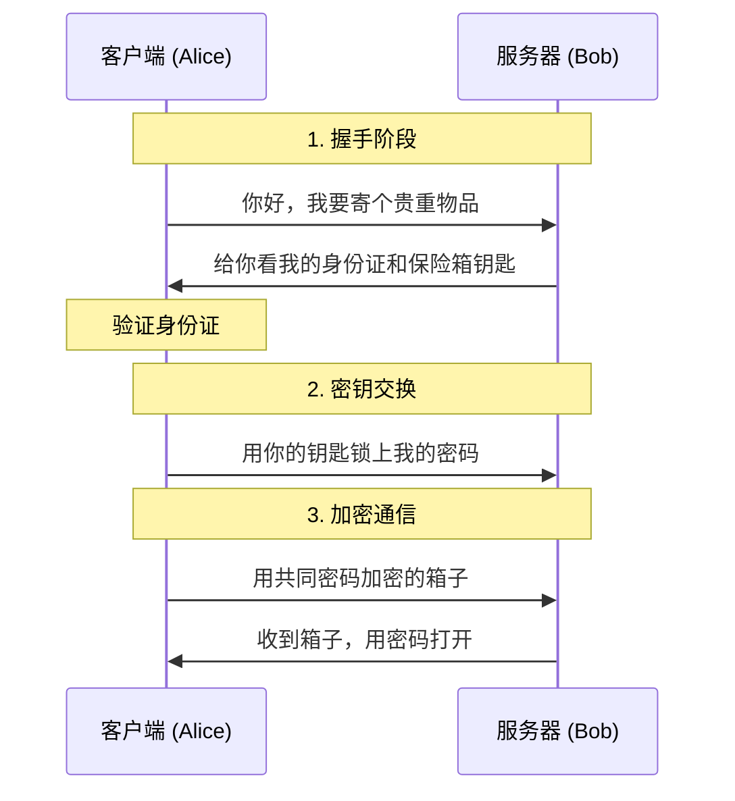
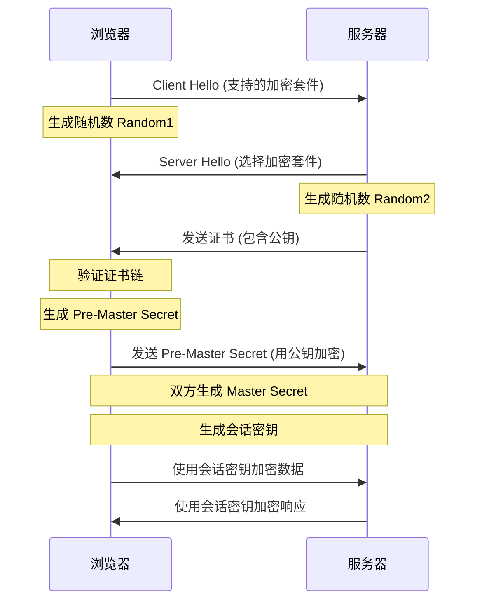
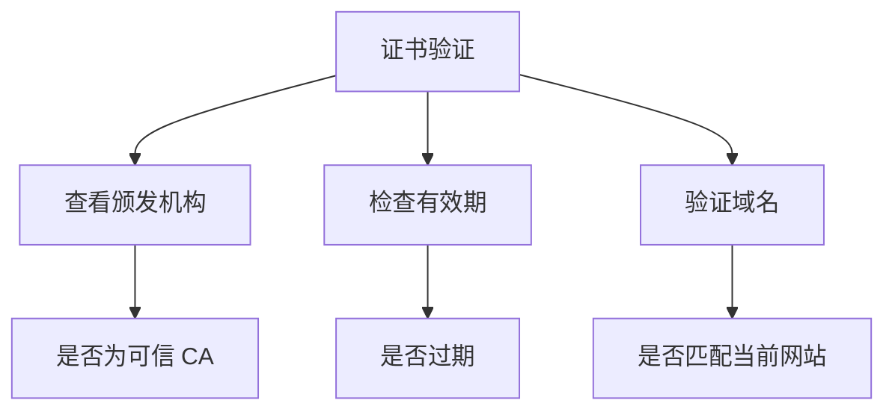

想象一下，你正在使用支付宝给朋友转账。你是否想过，为什么转账时地址栏会显示一个小锁头？为什么银行和支付网站都强调要看网址是否以 "https://" 开头？今天，让我们通过一个有趣的故事来了解 HTTPS 的前世今生。

## 为什么需要 HTTPS？

### 从一次网络劫持说起
小明在咖啡厅使用公共 WiFi 登录网上银行，殊不知隔壁桌的黑客正在使用"中间人攻击"监听整个网络。如果使用 HTTP，黑客可以：
1. 看到所有传输的数据（明文传输）
2. 修改请求和响应内容（数据篡改）
3. 伪装成银行网站（身份伪装）

这就像古代商队运送贵重物品时面临的挑战：
1. 确保货物不被劫匪偷窃（数据加密）
2. 防止货物被掉包（数据完整性）
3. 验证对方身份（身份认证）

在互联网时代，我们同样面临这些安全挑战。HTTP 就像是在马路上裸奔，而 HTTPS 则给数据穿上了一层防弹衣。

### 安全威胁分析



## HTTPS 是什么？

HTTPS（HyperText Transfer Protocol Secure）是 HTTP 协议的安全版本。它就像是给 HTTP 加了一个保险箱，通过 SSL/TLS 协议提供了三重保护：
- 加密（Encryption）：防止数据被窃听
- 完整性（Integrity）：防止数据被篡改
- 认证（Authentication）：防止身份被冒充

### SSL/TLS 协议族
TLS（Transport Layer Security）是 SSL（Secure Sockets Layer）的继任者：
- SSL 1.0：因安全问题未公开发布
- SSL 2.0/3.0：已被弃用
- TLS 1.0/1.1：已被主流浏览器弃用
- TLS 1.2：目前最广泛使用
- TLS 1.3：最新版本，提供更好的性能和安全性

## HTTPS 如何工作？一个形象的比喻

### 场景一：寄送贵重物品
想象 Alice 要给 Bob 寄一个装有贵重物品的箱子：



### 场景二：实际的 HTTPS 握手过程



### 密钥交换过程详解

1. **非对称加密**（公钥加密）
   ```javascript
   // 示例：RSA 密钥对生成（伪代码）
   const { publicKey, privateKey } = generateRSAKeyPair({
     modulusLength: 2048,
     publicExponent: 65537
   });
   ```

2. **对称加密**（会话密钥）
   ```javascript
   // 示例：AES-256-GCM 加密（伪代码）
   const sessionKey = generateRandomKey(256);
   const encryptedData = aesGcmEncrypt(data, sessionKey);
   ```

## 实践验证：如何确认 HTTPS 是否安全？

### 1. 证书检查
在浏览器中查看证书信息：
1. 点击地址栏的锁图标
2. 查看证书详情
3. 验证以下信息：
   - 颁发机构是否可信
   - 证书是否在有效期内
   - 域名是否匹配



### 2. 使用 OpenSSL 进行测试

```bash
# 查看服务器支持的 SSL/TLS 版本和加密套件
openssl s_client -connect example.com:443 -tls1_2

# 验证证书链
openssl verify -CAfile root.pem server.crt

# 检查证书信息
openssl x509 -in server.crt -text -noout
```

### 3. 安全评估工具
- [Qualys SSL Labs](https://www.ssllabs.com/ssltest/)
- [SecurityHeaders.com](https://securityheaders.com/)
- [Mozilla Observatory](https://observatory.mozilla.org/)

## HTTPS 的优点：为什么它如此重要？

### 1. 数据安全性
就像运钞车比普通卡车更安全一样，HTTPS 通过加密确保：
- 你的密码不会被黑客偷看
- 银行卡信息不会被窃取
- 通信内容不会被篡改

### 2. 提升用户信任
- 浏览器显示安全锁标志
- 提高用户购买转化率（平均提升 10-30%）
- 增强品牌可信度

### 3. SEO 优势
- Google 将 HTTPS 作为排名信号（约 1-5% 的权重）
- 提升搜索引擎排名
- 更好的用户体验指标（Core Web Vitals）

### 4. 合规性
- 符合 GDPR 等隐私法规
- 满足 PCI DSS 等支付行业标准
- 保护用户数据安全

## HTTPS 的挑战与解决方案

### 1. 性能影响
虽然 HTTPS 会带来一些性能开销，但通过以下方式可以最小化影响：

#### HTTP/2 支持
```nginx
# Nginx 配置示例
server {
    listen 443 ssl http2;
    ssl_protocols TLSv1.2 TLSv1.3;
    ssl_ciphers ECDHE-ECDSA-AES128-GCM-SHA256:ECDHE-RSA-AES128-GCM-SHA256;
    ssl_prefer_server_ciphers on;
    ssl_session_cache shared:SSL:10m;
    ssl_session_timeout 10m;
}
```

#### 会话复用
```nginx
# 启用会话缓存
ssl_session_cache shared:SSL:10m;
ssl_session_timeout 10m;
```

#### OCSP Stapling
```nginx
# 启用 OCSP Stapling
ssl_stapling on;
ssl_stapling_verify on;
resolver 8.8.8.8 8.8.4.4 valid=300s;
```

### 2. 成本考虑
现代化解决方案大大降低了 HTTPS 的使用门槛：

#### Let's Encrypt 自动化部署
```bash
# 使用 certbot 自动获取证书
certbot certonly --webroot -w /var/www/html -d example.com

# 自动续期
certbot renew --dry-run
```

#### 云服务配置
```javascript
// AWS Certificate Manager 示例
const cert = new acm.Certificate(this, 'Certificate', {
  domainName: 'example.com',
  validation: acm.CertificateValidation.fromDns()
});
```

## 最佳实践

### 1. 证书选择与管理
```bash
# 检查证书状态
openssl x509 -in cert.pem -text -noout | grep "Not After"

# 自动化更新脚本
#!/bin/bash
CERT_PATH="/etc/ssl/certs"
DAYS_BEFORE_EXPIRY=30

check_cert_expiry() {
    openssl x509 -enddate -noout -in "$1" | cut -d= -f2
}
```

### 2. 安全配置
```nginx
# 强制 HTTPS 跳转
server {
    listen 80;
    server_name example.com;
    return 301 https://$server_name$request_uri;
}

# HSTS 配置
add_header Strict-Transport-Security "max-age=31536000; includeSubDomains" always;
```

### 3. 性能优化
```nginx
# 启用 Brotli 压缩
brotli on;
brotli_comp_level 6;
brotli_types text/plain text/css application/javascript application/json image/svg+xml;
```

## 实际案例分析

### 案例一：银行转账
1. **场景**���用户在手机银行 App 进行转账
2. **安全措施**：
   - 证书固定（Certificate Pinning）
   - 双向认证（mTLS）
   - 额外的应用层加密

### 案例二：电商支付
1. **场景**：用户在电商平台完成支付
2. **安全措施**：
   - PCI DSS 合规
   - 防重放攻击
   - 交易签名验证

## 趣味小知识

你知道吗？
- 全球已有超过 95% 的网页浏览流量采用 HTTPS
- Let's Encrypt 每天发放超过 100 万张免费证书
- 一个普通的 HTTPS 握手仅需不到 100ms
- TLS 1.3 将握手时间缩短了 40%
- 使用 ECDSA 证书比 RSA 证书性能提升约 20%

## 常见问题解答（FAQ）

1. **为什么我的网站显示"不安全"？**
   - 混合内容（Mixed Content）问题
   - 证书过期或无效
   - 使用不安全的 TLS 版本

2. **如何处理开发环境的证书问题？**
   - 使用 mkcert 生成本地证书
   - 配置开发服务器信任自签名证书
   - 使用代理服务器处理 HTTPS

3. **HTTPS 会影响网站性能吗？**
   - 初次连接有约 100ms 延迟
   - 后续请求几乎无影响
   - HTTP/2 可能反而提升性能

## 总结

HTTPS 就像是互联网世界的安全带，虽然系上它可能会微花费一点时间，但为了安全，这点付出是值得的。随着技术的发展，部署 HTTPS 变得越来越简单，成本越来越低，没有理由不给你的网站加上这层保护。

## 延伸阅读

- [图解 SSL/TLS 协议](https://www.ruanyifeng.com/blog/2014/09/illustration-ssl.html)
- [Let's Encrypt 官方文档](https://letsencrypt.org/docs/)
- [HTTP/2 与 HTTPS](https://developers.google.com/web/fundamentals/performance/http2)
- [深入理解 TLS 1.3](https://blog.cloudflare.com/rfc-8446-aka-tls-1-3/)
- [HTTPS 最佳实践](https://httpsiseasy.com/)

<ArticleFooter />